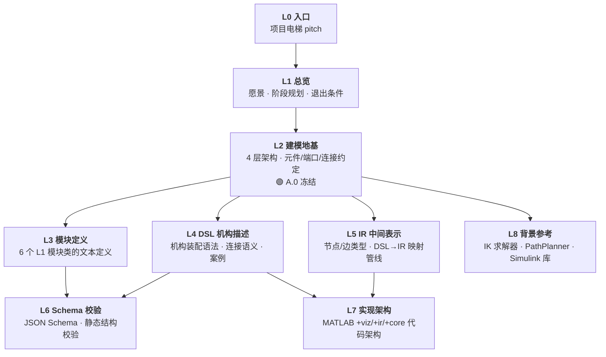

# 项目文档地图

> 本文档是全部 ~30 份技术文档的层次索引。每条目给出**一句话定位 + 在体系中的角色 +
> 依赖的上游文档 + 会影响的下游文档**。用于在修改某份文档前快速了解变更的波及范围。

---

## 1. 层级总览

自顶向下的 9 层文档架构。箭头表示层间依赖方向（上层定义约束，下层承接实现）。

---

## 2. 各层文件清单

### L0 · 入口

| 文件 | 说明 |
|------|------|
| `/README.md` | 项目电梯 pitch — 一句话说清项目是什么 |

### L1 · 总览

| 文件 | 说明 |
|------|------|
| `docs/project-overview.md` | **主文档**：愿景、技术路线、阶段 A.0–A.7 规划、退出条件。约 500 行，是项目的「圣经」。 |

### L2 · 建模地基（A.0 冻结）

| 文件 | 说明 |
|------|------|
| `specs/modeling-conventions.md` | **人的权威**：4 层架构、元件类型（body/frame/joint…）、坐标系/单位/旋转约定、端口/连接完整语义。约 600 行。 |
| `specs/terminology.md` | 中英术语对照表：元件名、层级名、端口语义标签、连接类型、参数作用域。 |
| `specs/conventions.yaml` | **机器的权威**：与 `modeling-conventions.md` 等价但机器可读。解释器与校验器以此文件为常量来源。约 100 行。 |

### L3 · 模块定义（A.1）

| 文件 | 说明 |
|------|------|
| `specs/modules/Frame.yaml` | `Frame` 立方体结构件（structural, 0 DOF, 1 body + 6 socket 端口） |
| `specs/modules/Pin.yaml` | `Pin` 销钉连接件（structural, 0 DOF, 1 body + 2 plug 端口） |
| `specs/modules/Joint.yaml` | `Joint` 铰接关节件（kinematic, 1 DOF revolute, 2 bodies + 2 plug 端口） |
| `specs/modules/Adaptor.yaml` | `Adaptor` 坐标适配件（structural, 0 DOF, 1 body + 2 plug 端口） |
| `specs/modules/ToolPipette.yaml` | `ToolPipette` 工具末端件（structural, 0 DOF, 1 body + 1 plug + 1 任务系） |
| `specs/modules/Manipulator.yaml` | `Manipulator` 外部驱动接口件（kinematic, 3 DOF cartesian, 4 bodies + 1 socket + 1 ground frame） |
| `specs/modules/README.md` | 模块库索引：三层数据结构说明、校验命令 |
| `specs/modules/config/dimensions.yaml` | 模块类几何参数取值（按 `module_type` 注入，v0 禁止 per-instance variant） |

### L4 · DSL 机构描述（A.2）

| 文件 | 说明 |
|------|------|
| `specs/dsl/grammar.md` | DSL v0 语法规范：顶层结构、实例声明、连接声明的合法字段与正则。**纯 L2 拓扑，不含执行语义。** |
| `specs/dsl/connection-semantics.md` | Mate 变换公式、`roll` 参数、`closed` 标记、极性门控、L2 vs L3 闭环语义。 |
| `specs/dsl/validation-checklist.md` | 校验分界清单：哪些项 Schema 可静态校验、哪些项需解释器加载模块库后校验。 |
| `specs/dsl/case-conventions.md` | DSL 案例目录规范、README 模板、Mermaid 装配流程图 7 规则。 |
| `specs/dsl/cases/open-chain-2r/` | 案例：2R 开环链（`robot_description.yaml` + `joint_config.yaml` + `README.md`） |
| `specs/dsl/cases/single-closed-loop/` | 案例：平行四边形单闭环（同上结构） |
| `specs/dsl/cases/m-rex-3t1r/` | 案例：M-REx 3T1R 世界系闭环（同上结构） |

### L5 · IR 中间表示（A.3）

| 文件 | 说明 |
|------|------|
| `specs/ir/node-types.md` | IR 节点类型规范：body / frame / joint 记录 / root node。以 `Expander.m` + `EdgeGraph.m` 代码为准反推。 |
| `specs/ir/edge-types.md` | IR 边类型规范：fixed / joint / mate / closed_mate，变换公式、双向插入规则、toStruct 过滤。以 `EdgeGraph.m` 为准。 |
| `specs/ir/dsl-to-ir-mapping.md` | DSL→IR 完整 7 步映射管线：加载→参数注入→展开→连接→root fallback→FK 传播。以 `Expander.m` 为准。 |
| `specs/ir/port-attachment.md` | Mate 连接在 IR 中的边表示：`addMate`（生成树边）vs `addClosedMate`（弦边）。DSL 层对应 `connection-semantics.md`。 |
| `specs/ir/symbol-registry.md` | ⚪ **待写** — 变量注册表规范（project-overview A.3.3 引用但尚未创建） |

### L6 · Schema 校验

| 文件 | 说明 |
|------|------|
| `specs/schema/module-definition.schema.yaml` | JSON Schema：校验 L1 模块 YAML 的字段完整性、类型、枚举值。 |
| `specs/schema/mechanism-assembly.schema.yaml` | JSON Schema：校验 L2 DSL YAML 的静态结构（实例声明 + 连接字段 + 正则）。 |
| `specs/schema/ir-graph.schema.yaml` | JSON Schema：校验展开后 IR 图的结构（概念校验用，不直接校验 MATLAB struct）。 |

### L7 · 实现架构

| 文件 | 说明 |
|------|------|
| `scripts/matlab/ARCHITECTURE.md` | **MATLAB 代码架构文档**：+viz → +ir（Expander + EdgeGraph + KinematicModel）→ +core（PosePropagator）四层架构、数据流图、设计决策。约 400 行。 |
| `scripts/matlab/README.md` | MATLAB 脚本用法说明（单模块可视化、机构装配可视化命令）。 |

### L8 · 背景参考

| 文件 | 说明 |
|------|------|
| `docs/reference/inverse-kinematics-solver-design.md` | MRF 2.4 IK 求解器设计文档 — 阶段 A.5 接入的现有求解模板。 |
| `docs/reference/pathplanner-architecture.md` | PathPlanner 架构文档 — 被替代的旧系统参考。 |
| `docs/reference/slx_module_reference/module_library_reference.md` | Simulink 模块库参考 — 模块 YAML 的原始数值提取来源。 |
| `docs/reference/urdf_module_reference/m-rex-urdf-analysis.md` | URDF 模块分析 — M-REx 的 URDF 表示参考。 |
| `docs/survey/robot-description-language-survey.md` | 机器人描述语言调研 — 背景材料，非规范文件。 |

---

## 3. 文件依赖关系

> 不同于 §2 按层级组织，本表按**文件**列出每条目的上下游依赖链，用于变更时快速定位波及范围。

| 路径 | 一句话定位 | 角色 | 上游依赖 | 下游影响 |
|------|----------|------|----------|----------|
| `/README.md` | 项目电梯 pitch — 一句话说清项目是什么 | 入口 | — | 无技术依赖 |
| `docs/project-overview.md` | **主文档**：愿景、技术路线、阶段 A.0–A.7 规划、退出条件 | 权威规划 | — | 全部下层文档的设计方向均源于此 |
| `specs/modeling-conventions.md` | **人的权威**：4 层架构、元件/端口/连接/坐标系完整约定（A.0 冻结） | 权威约定 | `project-overview.md` | `terminology.md`, `conventions.yaml`, 全部模块 YAML, `grammar.md`, `connection-semantics.md` |
| `specs/terminology.md` | 中英术语对照：元件名、层级名、语义标签、连接类型 | 参考词表 | `modeling-conventions.md` | 全部文档的术语一致性 |
| `specs/conventions.yaml` | **机器的权威**：与 `modeling-conventions.md` 等价的机器可读常量 | 权威常量 | `modeling-conventions.md` | 全部 3 份 schema, 解释器/校验器代码 |
| `specs/modules/*.yaml` | 6 份 L1 模块类文本定义（Frame/Pin/Joint/Adaptor/ToolPipette/Manipulator） | 权威数据 | `modeling-conventions.md`, `module-definition.schema.yaml` | DSL 案例, `Expander.m`（模块库加载） |
| `specs/dsl/grammar.md` | DSL v0 语法规范：实例声明、连接声明的合法字段与正则 | 权威语法 | `modeling-conventions.md` | `mechanism-assembly.schema.yaml`, `validation-checklist.md`, 全部 DSL 案例 |
| `specs/dsl/connection-semantics.md` | Mate 变换公式、`roll` 参数、`closed` 标记、极性门控、L2 vs L3 闭环 | 权威语义 | `modeling-conventions.md` | `port-attachment.md`, `grammar.md`（连接节）, `ARCHITECTURE.md` |
| `specs/dsl/validation-checklist.md` | Schema 静态校验 vs 解释器校验的分界清单 | 校验边界 | `grammar.md`, `mechanism-assembly.schema.yaml` | 解释器校验实现 |
| `specs/dsl/case-conventions.md` | DSL 案例目录规范、README 模板、Mermaid 绘图 7 规则 | 流程规范 | `grammar.md` | 全部 DSL 案例目录 |
| `specs/ir/node-types.md` | IR 节点类型（body/frame/joint 记录/root node） | 权威 IR 规范 | `modeling-conventions.md`, `Expander.m`, `EdgeGraph.m` | `ir-graph.schema.yaml`, `ARCHITECTURE.md` |
| `specs/ir/edge-types.md` | IR 边类型（fixed/joint/mate/closed_mate）、变换公式、toStruct 过滤 | 权威 IR 规范 | `EdgeGraph.m`, `conventions.yaml` | `port-attachment.md`, `ir-graph.schema.yaml`, `ARCHITECTURE.md` |
| `specs/ir/dsl-to-ir-mapping.md` | DSL→IR 完整 7 步映射管线（加载→参数注入→展开→连接→root→FK） | 权威 IR 规范 | `Expander.m`, `grammar.md`, `module-definition.schema.yaml` | `ARCHITECTURE.md` |
| `specs/ir/port-attachment.md` | Mate 连接在 IR 中的边表示（addMate vs addClosedMate） | 权威 IR 规范 | `connection-semantics.md`, `EdgeGraph.m` | `ir-graph.schema.yaml`, `ARCHITECTURE.md` |
| `specs/schema/*.schema.yaml` | 3 份 JSON Schema：模块 YAML / DSL YAML / IR 图 的结构校验 | 可执行校验 | 对应层的权威 docs + `conventions.yaml` | 校验工具链 |
| `scripts/matlab/ARCHITECTURE.md` | MATLAB 4 层代码架构（+viz / +ir / +core）、数据流、设计决策 | 实现文档 | 全部 IR spec, `connection-semantics.md`, `Expander.m`/`EdgeGraph.m` 代码 | `scripts/matlab/README.md` |
| `docs/reference/*` | 4 份背景参考：IK 求解器、PathPlanner、Simulink 库、URDF 分析 | 背景参考 | — | `project-overview.md`（引为参考依据） |

---

## 4. 变更传播速查

| 改了这个文件… | 必须检查 / 同步更新… |
|------|------|
| `conventions.yaml` | `modeling-conventions.md` + `terminology.md` + 全部 3 份 schema + 全部 4 份 IR spec |
| `modeling-conventions.md` | `conventions.yaml` + `terminology.md`（双轨同步） |
| 模块 YAML（如 `Frame.yaml`） | `modeling-conventions.md` §5 + `module-definition.schema.yaml`（若新增字段）+ `modules/README.md` |
| `grammar.md` | `mechanism-assembly.schema.yaml` + `validation-checklist.md` + 全部 DSL 案例 YAML |
| `connection-semantics.md` | `port-attachment.md` + `grammar.md`（连接节）+ `ARCHITECTURE.md` |
| `EdgeGraph.m` | `edge-types.md` + `node-types.md` + `dsl-to-ir-mapping.md` + `port-attachment.md` + `ir-graph.schema.yaml` + `ARCHITECTURE.md` |
| `Expander.m` | `dsl-to-ir-mapping.md` + `node-types.md` + `ARCHITECTURE.md` |
| `PosePropagator.m` | `edge-types.md` + `ARCHITECTURE.md` |
| `project-overview.md` | 阶段描述变化的对应 spec 文件（如 A.2 变更 → `grammar.md`、DSL 案例） |

---

## 5. 文档成熟度

| 状态 | 文件 |
|------|------|
| 🟢 **冻结（A.0）** | `modeling-conventions.md`, `terminology.md`, `conventions.yaml` — 地基文件，修改需全盘同步 |
| 🟢 **活跃（A.1–A.3）** | `specs/modules/*.yaml`, `specs/dsl/*.md`, `specs/ir/*.md`, `specs/schema/*.yaml`, `ARCHITECTURE.md` — 随阶段推进持续迭代 |
| 🟡 **过时** | `/README.md` — 描述的目录结构与实际不符（`cases/`、`architecture/`、`design/`、`decisions/` 不存在）；`specs/README.md` — 同样描述不存在的子目录 |
| ⚪ **待写** | `specs/ir/symbol-registry.md`（project-overview A.3.3 引用但尚未创建） |

---

## 6. 场景导航

| 我想做这件事… | 推荐阅读顺序 |
|------|------|
| **理解项目全貌** | `project-overview.md` → `modeling-conventions.md` → 回到本文档按需查阅 |
| **定义新模块** | `modeling-conventions.md` §3（元件类型）→ `module-definition.schema.yaml`（字段约束）→ 参考现有 `specs/modules/*.yaml` → 更新 `modules/README.md` |
| **写 DSL 机构案例** | `grammar.md` → `connection-semantics.md` → `case-conventions.md` → 参考 `specs/dsl/cases/open-chain-2r/` |
| **理解连接语义（mate/roll/closed）** | `modeling-conventions.md` §9–§10 → `connection-semantics.md` → 如需 IR 层视角：`port-attachment.md` |
| **理解 IR 展开管线** | `dsl-to-ir-mapping.md`（7 步管线总览）→ `node-types.md` + `edge-types.md`（节点/边细节）→ `port-attachment.md`（mate 边） |
| **理解 MATLAB 代码架构** | `ARCHITECTURE.md` → 对照阅读 `Expander.m` / `EdgeGraph.m` / `PosePropagator.m` 源码 |
| **修改 IR 实现（EdgeGraph/Expander）** | 先在「变更传播速查」中确认波及范围 → 改代码 → 按速查表同步更新受影响文档 |
| **修改建模约定（A.0 地基）** | ⚠️ 高风险：`modeling-conventions.md` + `conventions.yaml` + `terminology.md` 三文件必须同步 → 按速查表检查全部 3 份 schema + 4 份 IR spec |

> **精简工作提示**：详见 [`docs/redundancy-notes.md`](redundancy-notes.md) — 含跨文档重叠分析（6 处）+ 逐文档冗余诊断（11 份文档）+ 精简工作量估算（目标缩减 ~40%）。
