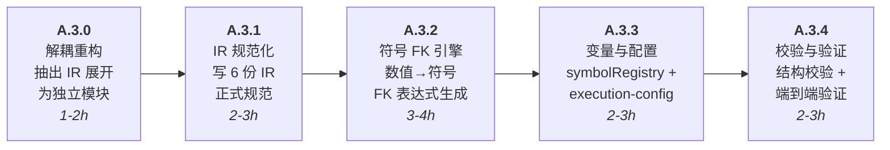
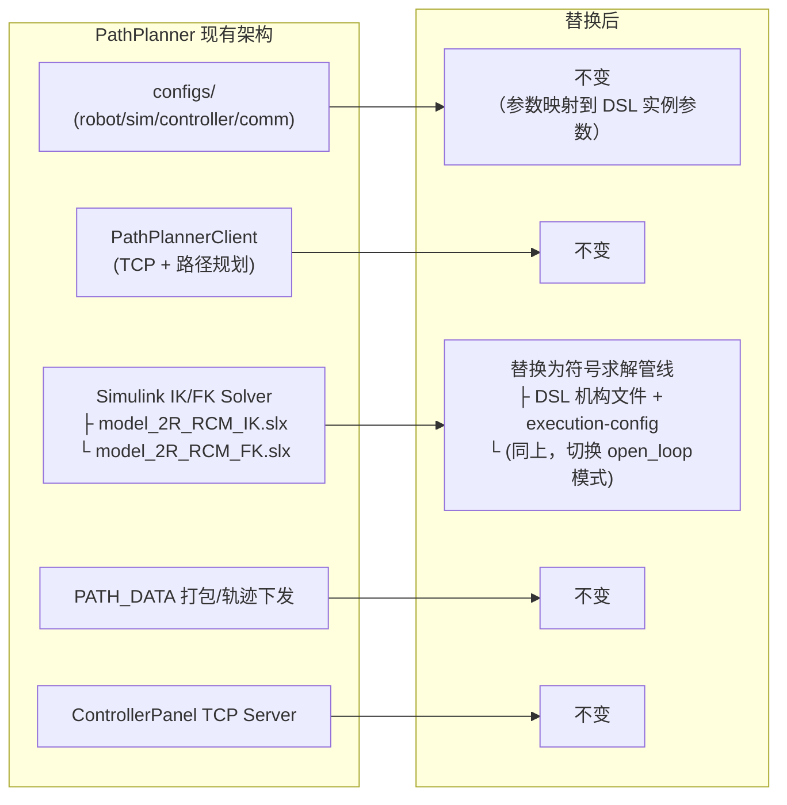

# 符号学运动学架构项目说明
> 从 [[../便笺📋|便笺📋]] 迁移。**这是 MRE 技术演进中最重要的计划之一。**

## 现状与瓶颈

当前 PathPlanner 核心求解器基于 Simulink 多体物理仿真。在现阶段有图形化建模直观、支持模块化闭环拓扑等优点，但面临根本性制约，导致整个系统不能完全迁移到现代开发框架（如 Electron、Three.js 等）：

- **环境依赖：** 高度依赖特定环境——必须要启动 MATLAB 和完整的 Simulink 环境，不能打包编译为可执行文件或独立依赖。这是通往可部署系统的第一道墙。
- **执行效率：** 仿真较慢，且是单次轨迹规划（像函数一样输入目标位姿输出操作器轨迹），不支持实时伺服控制。所以像手术机器人一样的顺畅实感控制非常难。
- **可拓展性存疑：** Simulink 模型能不能接入强化学习、进化学习等算法有待验证。
- **架构锁死的根源：** 整个系统无法迁移到现代框架最根本的原因，就是没有其他机器人控制系统能像 Simulink 一样支持模块化闭环机构。就算把求解器之上的部分解耦出来，那也不过是在 PathPlanner 底层架构上套了一层壳，让系统变得更加复杂，也没有根本解决可拓展性和运行效率的问题。

## 核心思路

对于机器人正逆运动学来说，基于解析运动学模型肯定比基于仿真的模型更理想。因此核心构想是开发一套**符号学架构**——不再是通过图形窗口拖拽单元构建闭环机构，而是用类似 DNA 编码的自定义符号规则来编码具体的闭环机构。由此生成基于几何关系或优化器的正逆运动学解析模型，从根本上替代 Simulink 仿真求解器。

核心命题：「模块化闭环机构拓扑编码」→「正逆运动学方程」的自动生成算法。理论上应该可行，实际开发难度未知。代表模块和关节的代码应该严谨，编码出来的拓扑结构需要足够明确无歧义，生成器才能充分理解并构建对应的正逆运动学模型。

## 可行性依据

这种运动学方程生成算法依据的原理其实有迹可循。在六自由度 MRF 关节中，运动学解耦层就没有显式推导运动学方程，而是先使用纯空间变换公式描述运动学拓扑，并使用 fmincon 等求解器取得逆运动学解析解（给定跟随平台位姿求解三个滑动片的位移与旋转）。理论上正运动学问题也可以依赖此框架解决。

对于模块化机构来说，由于模块架构更接近体素构建，可以参考 URDF 和 DH 参数等描述体系——每个体素都有六个连接点位，因此可以构建一套类 XML 符号规则来表示单个模块以及模块之间的连接关系。还需要编写一个解释器来把自定义的机器人描述翻译成运动学空间变换公式，之后就可以采用和 MRF 关节同样的流程来求解了。

## 什么是 DSL

这里后续反复出现的 `DSL`，是 `Domain-Specific Language` 的缩写，中文可理解为“领域专用语言”或“领域特定语言”。

在本项目里，`DSL` 不是指一种通用编程语言，而是指一套**专门用于描述模块化机构本身**的文本规则。它的作用不是直接求解 FK/IK，而是先把机构结构严谨写清楚，再交给解释器翻译成符号运动学模型。

更具体地说，这套 DSL 至少需要能表达：

- 有哪些模块类型
- 每个模块有哪些端口和局部坐标系
- 模块之间如何连接
- 哪些连接对应固定变换，哪些对应关节自由度
- 哪些参数属于模块，哪些参数属于机构实例
- 哪些量在求解时是输入，哪些量是待求未知量

所以，DSL 在本项目中的定位更接近“机构结构说明书”，而不是“求解器本体”。

它与后续几个核心层次的关系可以概括为：

1. **模块定义 schema**：规定一个模块应该有哪些字段，这是 DSL 的静态结构约束。
2. **机构装配 DSL**：用文本写出某个具体机构是由哪些模块拼起来的。
3. **解释器**：读取 DSL，构建机构图、刚体变换链和约束集合。
4. **符号模型 / 求解管线**：把解释器输出继续翻译成现有 MATLAB 工作流可处理的 FK/IK 残差系统。

因此，后面如果提到“先定义 DSL”，更准确的意思其实是：

> 先定义一套能严谨描述模块化机构拓扑、端口、连接和参数的文本语言，再由解释器把它编译成可求解的运动学模型。

### 什么是 IR

这里还需要补一层经常会在解释器设计里出现的术语：`IR`，即 `Intermediate Representation`，中文通常叫“中间表示”。严格来说，**不是“解释器叫 IR”**，而是解释器在吃下 DSL 之后，通常会先把 DSL 编译成一份更规整、更适合算法处理的内部结构，这一层内部结构就叫 IR。

之所以需要 IR，而不是直接从 DSL 文本一步到位生成 FK/IK 方程，原因在于 DSL 更偏“给人写”的结构说明书，而求解前的计算过程更需要一份“给程序算”的规范化模型。两者关注点不同：

- **DSL** 负责表达用户意图：有哪些模块、怎么连接、哪些参数外露、哪个坐标系是任务输出。
- **IR** 负责表达计算对象：有哪些 `body`、`frame`、`fixedTransform`、`joint`、`constraint` 节点/边，它们如何组成一张可遍历、可校验、可生成方程的图。

在本项目中，IR 可以理解为 DSL 和求解器之间的那层“翻译缓冲层”。它至少有三件事要做：

- 消除 DSL 表面语法差异，把不同写法归一化成同一种内部图结构。
- 完成参数绑定、符号变量注册、端口连接展开和结构合法性校验。
- 为后续开环 FK 传播和闭环约束构造提供统一输入，而不是让求解器直接处理原始 DSL 文本。

所以，如果后面文档里出现 `body / frame / joint` 这类更接近数据结构或图节点的说法，通常讨论的就是 IR 层，而不是 DSL 源码层。也正因为如此，A.3 建议显式维护 `body / frame / joint` 节点、`fixedTransform` 边、`portAttachment` 映射和 `symbolRegistry`，本质上就是在定义第一版解释器 IR。

## 技术路线

**阶段 A · 核心算法验证（MATLAB）**

目标：证明「拓扑编码 → 正逆运动学方程」的自动生成算法可行。

直接复用 MRF 2.4 已验证的求解管线（符号变量定义 → 支链正向传播 → 闭环约束构造 → `subs` 代入 → `matlabFunction` 转数值 → `fmincon` SQP 求解 → 残差阈值验证），只替换编码生成器部分。此阶段不改动求解流程，最大限度降低验证风险。

这一阶段的真正难点不在求解器，而在求解器之前的两层中间能力：

1. **严谨的符号化模块描述**：把模块、端口、局部坐标系、几何参数、关节自由度和模块内部拓扑写成无歧义文本定义。
2. **稳健的解释器**：把一份符号化机构描述翻译成可计算的刚体变换链、约束集合和未知量集合，并接入现有 MATLAB 求解工作流。

因此，阶段 A 不应再被视为“直接做 IK”，而应被拆成“模块库形式化 → 解释器 → 开环验证 → 闭环验证 → 接入既有求解模板”五段连续任务。

### 阶段 A 的工作边界

- **本阶段要解决的问题：** 证明自定义拓扑编码可以稳定生成与机构几何一致的符号运动学模型。
- **本阶段刻意不解决的问题：** 实时性、跨平台实现、求解器性能优化、大规模模块库扩展、图形编辑器。
- **本阶段的成功标准：** 至少一类开环机构和一类闭环机构，能够从同一套模块描述语言自动生成 FK/IK 所需的几何表达式，并复用 MRF 2.4 风格的数值求解流程得到合理结果。

### 阶段 A.0 · 统一建模约定

目标：先冻结一套后续所有模块定义和解释器都必须遵守的基础规则，避免后面反复返工。完整冻结版见 [specs/modeling-conventions.md](../specs/modeling-conventions.md)。

**层级架构（建模层次）**

整个符号化体系自底向上分为四层，每层只由下一层组合而成，不跨层耦合：

- **L0 元件（Element）**：建模原语，即 `Body`、`Frame`、`Port`、`FixedTransform`、`Joint`、`Constraint`。类比 Simscape 基本块或 URDF 基本类型，是体系最底层、不可再分的语素。
- **L1 模块（Module）**：把若干元件封装成的**参数化模板**，相当于一个类——定义一次、多次实例化。参考来源是 `slx_module_reference` 的库模块（`Frame`、`Pin`、`Joint`、`Adaptor`、`ToolPipette`），类比 Simulink 的 masked subsystem / library，或 OOP 的类加 xacro 宏。注意模块层的「`Frame` 模块」与元件层的「`Frame` 坐标系」同名但不同物。模块对外只暴露 `Port`。
- **L2 机构（Mechanism）**：多个模块实例按端口连接组成的机构本体，类比 Simulink 子系统。机构只描述「本体长什么样、怎么拼」，可以是开环（树）或含闭环（一般图）。

  **FK 传播范式：工具端生长（Tool-Rooted Growth）**

  正向运动学（FK）传播需要一个起点（root node），以此处 $T = I_4$ 为种子沿图边向外传播位姿。与传统机器人学「基座固定」的思路不同，模块化机构的自然装配方向是**从工具端向外生长**：

  - 先确定工具模块（如 `ToolPipette`）的参考坐标系 → 沿连接链逐步定位相邻模块 → 最终抵达 `Manipulator` 外部驱动端
  - FK 传播的 root node 由 `semantic_tag: root` 标记（如 `ToolPipette.tip_origin`），该 frame 在展开时自动调用 `addRoot()` 注册
  - `semantic_tag: ground`（如 `Manipulator.ground`）是**不同的标签**，用于标识 L3 世界绑定端点，**不**触发自动 root 注册——两个标签语义分离：`root` 管 FK 传播起点，`ground` 管 L3 接地端点识别
  - 若所有模块均无 `semantic_tag: root` 的 frame，则 fallback 到第一个 DSL 实例的第一个 body 作为 root；支持多 root（多次调用 `addRoot()`），适用于多分支 / 并联机构

  此范式将机构视为从效应器（end-effector）倒推回驱动源的有向图，而非从基座正向生长的串联链——更贴合工具优先的模块化设计思维。
- **L3 执行层（Execution）**：把机构本体接入世界系与驱动源，闭合成自洽、可求解的系统。它定义「机构如何被固定、如何被驱动、闭环判据是什么」。
  - **世界系闭环（M-REx 主构型，主导模式）**：当前绝大多数模块化 M-REx 配置采用此模式。机构本体在 DSL 中描述为**开环链**（不写 `closed: true`），挂载到多台外部驱动器（`Manipulator` 模块）上。在 Tool-Rooted Growth 范式下，末端效应器任务系（如 `ToolPipette.tip_origin`，标记 `semantic_tag: root`）在零位构型下与世界原点重合（$T = I_4$）。FK 从工具端向外传播，到达每台 `Manipulator` 的 `ground` frame 时自然产生一个由机构几何决定的静态偏移位姿。L3 执行层将此偏移记录为 `world_binding` 的标定变换，每条 `Manipulator` 的 `ground` frame 均通过各自的静态标定偏移绑定到同一 `world` 参考系。**闭合不发生在模块端口之间，而发生在世界参考系**——所有 ground frame 共享同一 `world` 参考系，两条传播路径到达机构本体同一点时位姿应一致。闭合判据为 L3 `closure_cuts` 声明的切口处相对位姿残差。外部驱动器由 `Manipulator` 关节模块物化（内部三个 `prismatic` 组合成 3-DOF 笛卡尔驱动，机构侧以 `socket` 对接，世界侧以 `ground` frame 由 L3 绑定到 `world`）。
  - **L2 内部闭环（四杆环等，辅助验证模式）**：机构本体在 DSL 中即含 `closed: true` 标记，回路在模块端口之间闭合。主要用于验证 A.4 的回路识别与约束构造逻辑，不是实际 M-REx 部署的目标构型。
  - **开环驱动（测试构型）**：若关节自身可驱动（`actuated`），则无需外部驱动器，直接驱动关节即可形成开环串联构型（如 3R 链），解释器直接输出从世界系到末端的正运动学表达式。

两种闭环模式的详细对比与可视化行为见 `specs/dsl/connection-semantics.md` §6.4。

同一套机构本体（L2）可接入不同执行层（L3）：闭环执行得到闭环 IK 残差，开环执行得到开环 FK 表达式。这正是测试时「先用最简开环（如 3R 链）跑通、再上闭环 M-REx 机构」的依据。解释器读取 L1+L2+L3，沿层级链展开成元件级图，再生成与 [inverse-kinematics-solver-design.md](reference/inverse-kinematics-solver-design.md) 同构的几何约束（闭环）或正运动学表达式（开环），交给求解器。

具体任务：

- 固化上述四层架构，明确每层只由下一层组合而成、跨层只能通过 `Port` 交互。
- 统一全局坐标系约定、右手系规则、旋转正方向、长度单位和角度单位。
- 统一模块端口的命名规则，例如 `faceXPlus`、`sideA`、`linkB` 这种“语义名 + 朝向/角色”的组合。
- 统一端口的数学含义：端口本质上是一个 `exposed=true` 的局部参考坐标系，而不只是一个连接点；`+Z` 统一为朝外对插法向，并用**极性**（`socket`/`plug`）区分公母、用**旋转对称阶**约束离散装配朝向。
- 统一“连接”的定义：所有端口 `+Z` 朝外，连接即“面对面对插”，解释器按极性自动施加标准 mate 变换（仅 `socket↔plug` 合法）；装配时绕法向的朝向选择由连接级**离散 `roll`** 表达（仅离散，连续转动改用 `Joint` 模块），坐标适配仍通过插入 `Adaptor` 模块实现。
- 统一参数作用域：哪些参数属于模块类定义，哪些参数属于实例，哪些参数属于整个机构配置。
- 统一执行层语义：外部驱动力旋量与世界系如何闭合回路、`actuated` 关节如何形成开环、闭环判据如何定义。

产出：

| 文件 | 内容 |
|------|------|
| `specs/modeling-conventions.md` | 建模约定 prose（人的权威）：四层架构、元件类型、坐标系/单位/旋转约定、端口与连接语义、参数作用域 |
| `specs/terminology.md` | 中英术语对照表：元件名、层级名、端口语义标签、连接类型、参数作用域 |
| `specs/conventions.yaml` | 建模常量（机器的权威）：层级定义、元件类型枚举、语义标签枚举、端口/连接/执行层规则，供解释器与校验器读入 |

过关标准：

- 任意一个模块定义在不看图的前提下，也能仅靠文本约定被唯一解释。
- 约定文档（prose）、术语表、机器可读常量三者无矛盾。

### 阶段 A.1 · 模块库符号化定义

目标：把现有 Simulink 模块库抽象成文本优先的模块定义表，先建立最小闭环机构所需的核心模块集。

起步建议直接以当前已拆解的库模块为最小集合：`Frame`、`Pin`、`Joint`、`Adaptor`、`ToolPipette`。`slx` 只作为参考源，最终权威定义必须落在文本格式中。

具体任务：

- 为每个模块定义唯一 `module_type`。
- 为每个模块列出：几何参数、外部端口、内部刚体、内部关节、内部固定变换、功能参考点。
- 为每个端口定义局部坐标系，包括原点位置、主轴方向、法向约定和端口角色。
- 为每个关节定义自由度类型和变量名约定，例如 `revolute(q)`、`prismatic(d)`。
- 区分“结构模块”和“运动模块”：例如 `Frame` 偏结构实体，`Joint` 偏运动原语，`Adaptor` 偏坐标适配。
- 允许参数表达式保留符号形式，例如 `cubeLength/2`、`-tipDistance`，不要在模块定义阶段强制数值化。

建议的数据层次至少包含三层：

- `模块定义表`：模块是什么。
- `端口框架表`：模块对外暴露哪些局部坐标系。
- `内部运动学图`：这些端口如何通过刚体变换和关节连接到模块内部参考体。

产出：

| 文件 | 内容 |
|------|------|
| `specs/schema/module-definition.schema.yaml` | JSON Schema，校验模块 YAML 的字段完整性、类型、枚举值（三层数据结构 + 跨字段 `allOf` 约束） |
| `specs/modules/Frame.yaml` | `Frame` 立方体结构件（structural, 0 DOF, 1 body + 6 socket 端口） |
| `specs/modules/Pin.yaml` | `Pin` 销钉连接件（structural, 0 DOF, 1 body + 2 plug 端口） |
| `specs/modules/Joint.yaml` | `Joint` 铰接关节件（kinematic, 1 DOF revolute, 2 bodies + 2 plug 端口） |
| `specs/modules/Adaptor.yaml` | `Adaptor` 坐标适配件（structural, 0 DOF, 1 body + 2 plug 端口） |
| `specs/modules/ToolPipette.yaml` | `ToolPipette` 工具末端件（structural, 0 DOF, 1 body + 1 plug + 1 任务系） |
| `specs/modules/Manipulator.yaml` | `Manipulator` 外部驱动接口件（kinematic, 3 DOF cartesian = 3 prismatic, 4 bodies + 1 socket + 1 ground frame, 非 SLX 来源） |

过关标准：

- 任意一个核心模块都可以脱离 `slx` 单独实例化。
- 全部模块 YAML 通过 `module-definition.schema.yaml` 校验。
- 使用文本定义重建出的模块端口位姿关系，与 `slx` 中对应模块的参考框架关系一致。
- `Manipulator` 零位（dx=dy=dz=0）内部链为恒等，满足 §2.4 初始零位条件。

### 阶段 A.2 · 机构描述语言（DSL）v0

目标：在模块定义之上，再定义一层「如何拼机构」的语言，使机构拓扑可以文本化表达。

这一层不要一开始就追求复杂语法。优先保证语义严谨、易解析、可验证。
DSL 在本阶段的定位是「机构结构说明书」——描述哪些模块实例、如何连接、哪些变量暴露，
不涉及求解。A.3 解释器将其编译为 IR。

#### A.2.1 DSL 语法规范

定义 DSL 的完整语法规则，使每份机构描述文件有唯一合法写法。

DSL 定位为 L2 纯拓扑——只描述机构本体由哪些模块实例组成、如何按端口连接，不涉及求解或执行语义：

- 模块实例声明语法：YAML 映射，键为实例名，值为 `type: <ModuleType>`。参数值由 `config/parameters.yaml` 按 `module_type` 统一注入（v0 禁止 per-instance variant）。
- 连接语法：`ports: [<instance>.<port>, <instance>.<port>]`，含可选的 `roll` 装配参数（离散滚转）与 `closed` 闭环标记（补边）。
- DSL **不包含** 以下内容（全部归 L3 execution-config）：世界系绑定（`world`）、末端坐标系指定（`endFrame`）、驱动指派（`actuated`）、变量分区（`known`/`unknown`）。

详见 `grammar.md` §1.2 的设计依据：同一套机构本体（L2）可接入不同执行层（L3），把执行语义写进 DSL 会破坏复用性。

产出文件：

| 文件 | 内容 |
|------|------|
| `specs/dsl/grammar.md` | DSL 语法规范（EBNF 或结构化 prose） |
| `specs/dsl/connection-semantics.md` | 端口连接在 DSL 层的语义：mate 展开规则、`roll` 参数语法、极性门控的 DSL 表达 |
| `specs/schema/mechanism-assembly.schema.yaml` | JSON Schema，校验 DSL 机构描述文件的静态结构 |

#### A.2.2 DSL 校验 schema

`mechanism-assembly.schema.yaml` 校验的内容（静态结构，Schema 可覆盖）：

- 顶层字段完整且无多余键；`dsl_version == 0`
- 每个实例含 `type`，`type` 符合 UpperCamelCase 正则
- 每条连接 `ports` 恰为 2 元素，符合端口引用正则
- `roll` 为非负整数，`closed` 为布尔

以下跨文件 / 跨数组语义由解释器校验（Schema 无法表达，见 `validation-checklist.md`）：

- 每个实例 `type` 在模块库中存在
- 每个连接两端的端口名在其模块定义中注册且 `exposed: true`
- 连接极性满足 `socket↔plug`
- 端口不被重复占用
- `roll` 落在 `0 .. symmetry-1`
- `closed: true` 连接确实闭合一个 L2 回路

#### A.2.3 DSL 示例

三个最小示例，覆盖从开环到闭环的验证路径：

| 示例文件 | 结构 | 验证目标 |
|------|------|------|
| `specs/dsl/examples/open-chain-2r/robot_description.yaml` | 两段串联转动副 | 变换传播、端口拼接、FK 输出 |
| `specs/dsl/examples/single-closed-loop/robot_description.yaml` | 平行四边形单闭环 | 闭环约束提取、未知量识别 |

每个示例必须附带：
- 拓扑图（Mermaid 或 ASCII art，可放在示例文件头部注释中）
- 符号变量表

#### A.2.4 过关标准

- 同一机构结构不存在两种等价但解释不同的 DSL 写法。
- `mechanism-assembly.schema.yaml` 对非法连接、重复占用端口、悬空端口、缺失字段能明确报错（校验器拒绝）。
- 三个示例均通过 schema 校验。

#### A.2.5 · DSL 装配可视化验证

目标：编写模块组装后的可视化脚本，在 DSL 层面直接验证装配语法能否正确拼出模块化机构。与 A.1 中 `visualize_module.m` 对单模块做内部 frame graph 可视化同理，本节的脚本面向「机构级」——读入 DSL 机构描述文件，按连接规则组装多个模块实例并绘制完整的装配体。

这是 A.2 与 A.1 之间的关键桥接验证：A.1 验证每个模块自身定义正确，A.2.5 验证多个模块按 DSL 连接后整体几何正确。如果这一步不过，A.3 解释器的变换链推导就缺少可信的几何参照。

**设计原则：复用 A.1 的显示原语。** `visualize_mechanism` 不重写渲染逻辑，而是复用 `visualize_module.m` 中已验证的显示管线。具体而言，`local_triad`（RGB 坐标三轴）、`local_import_geometry` / `local_patch_geometry`（STEP 几何渲染）、FK 迭代传播算法和 frame 位姿报告等核心原语应抽成共享工具函数。机构级脚本的增量工作集中在「多实例图构建」——解析 DSL 机构文件、加载多模块定义、插入实例间 mate 连接边、处理命名空间前缀——构建完毕后交给同一套渲染管线出图。

具体任务：

- 将 `visualize_module.m` 中的 `local_triad`、几何导入渲染、FK 传播、位姿报告等显示原语抽取为共享工具文件（如 `viz_common.m` 或 `+viz` 包目录），供 A.1 与 A.2.5 共用。
- 编写 `visualize_mechanism.m`：读入一份 DSL 机构描述文件（如 `specs/dsl/examples/open-chain-2r/robot_description.yaml`），解析其中的实例声明、端口连接和参数赋值。
- 对每个实例，加载对应模块 YAML 定义（复用 A.1 的模块库），按实例参数注入数值，构建模块自身的 frame graph，并为所有内部 frame/body 名加实例名前缀以避免跨实例命名冲突。
- 按 DSL 连接声明，在实例之间插入 mate 变换边（`Rx(π) · Rz(roll)`，与 `modeling-conventions.md` §10.2 一致），将分散的模块 frame graph 拼合成一张全局机构图。
- 处理 `world` 绑定：FK 传播的 root node 为 `semantic_tag: root` 标记的 frame（如 `tip_origin`），其位姿种子为 $I_4$（即末端效应器与世界原点重合）。从 root 向外传播后，每个 `semantic_tag: ground` 的 frame 得到一个由机构几何决定的位姿——该位姿即为其相对 `world` 的静态标定偏移，记录在 `world_binding` 中。
- 调用共享 FK 传播与渲染管线，计算所有 body 中心坐标系和 port 坐标系的全局位姿并出图。
- 可视化输出：
  - 每个 body 的 STEP 几何（若有）或简化包围盒。
  - 每个 frame/port 的 RGB 坐标三轴（X=红, Y=绿, Z=蓝）。
  - 连接边以虚线或半透明线段标注，便于直观检查端口对插是否对齐。
  - 关节轴以不同颜色高亮，标注自由度方向。
- 支持 `mechanism_viz_config.yaml` 注入关节变量值（如转动角 `q`、Manipulator 位移 `dx/dy/dz`），可视化特定构型姿态。
- 输出每个实例的 frame 全局位姿报告，供与手工推导的变换链做数值对比验证。

**M-REx 世界系闭环的可视化**：对于 L3 世界系闭环构型（当前主导模式），DSL 中机构本体是开环链、
没有 `closed: true` 边。可视化时末端效应器（`tip_origin`）位于世界原点（$T = I_4$），
各 `Manipulator.ground` frame 位于各自的静态标定偏移位置——机构本体作为开环链挂在两者之间。
若 Manipulator 关节值满足闭环约束，机构本体两端位姿连续（无错位）；若不满足，两端出现
位姿不连续。详细行为见 `specs/dsl/connection-semantics.md` §6.4。

产出：

| 文件 | 内容 |
|------|------|
| `scripts/matlab/visualize_mechanism.m` | DSL 机构装配可视化主脚本 |
| `specs/dsl/examples/mechanism_name/joint_config.yaml` | 机构可视化参数注入配置（关节变量值等） |

过关标准：

- 对 A.2.3 的三个 DSL 示例（开环 2R 链、单闭环、并联雏形），`visualize_mechanism` 均能正确渲染完整装配体。
- 端口对插处在视觉上对齐（mate 变换后两端口坐标系原点重合、法向相反），无肉眼可见错位。
- 全局 frame 位姿报告与手工推导的变换链数值一致（误差 < 1e-9）。
- 修改变量注入配置后刷新可视化，关节姿态变化符合预期。

### 阶段 A.3 · 解释器 v0：先跑通开环

> **状态**：A.2.5 可视化代码中已完成 IR 展开的数值实现（`localExpandInstance` + `EdgeGraph` +
> `PosePropagator` 三层架构）。A.3 的核心工作是将这套已验证的展开逻辑解耦为独立模块，升级为符号 FK
> 生成，并补齐变量注册、执行配置、结构校验等外围设施。

#### 现有基础（A.2.5 中已完成，可复用）

| 能力 | 实现位置 | 说明 |
|------|------|------|
| 实例展开 + 名前缀 | `+viz/mechanism.m` → `localExpandInstance` | 复制模块模板，展开 bodies/frames/fixed_transforms/joints，加 `instanceName.` 前缀 |
| 参数绑定 | `+core/CommonUtils.m` → `evalScalar`/`evalVec` | 符号表达式求值：`cubeLength/2` → 数值 |
| 参数注入 | `+viz/mechanism.m` L60-70 | `dimensions.yaml`（按 module_type）+ per-example `joint_config.yaml`（按实例名覆盖） |
| 端口连接 → mate 边 | `+viz/mechanism.m` L105-137 | 极性校验 + `Rx(π)·Rz(roll)` mate 变换 + `addMate`/`addClosedMate` |
| IR 图累积器 | `+ir/EdgeGraph.m` | handle class：body/frame/joint 节点，fixed/joint/mate/closed_mate 边，root nodes，传播 |
| FK 传播引擎 | `+core/PosePropagator.m` | `propagatePoses`：迭代 FK，当前为**数值**计算 |
| 旋转表示求值 | `+core/RigidBodyMath.m` → `rot` | 支持 align / rpy / axis_angle 三种表示 |
| Root node 自动注册 | `ir.Expander` → `localExpandInstance` | 检测 `semantic_tag: ground` → 自动 `g.addRoot()` |
| 模块库加载 + 缓存 | `+viz/mechanism.m` → `defCache` | `containers.Map` 按 module_type 缓存 |

#### A.3 修订路线图总览



---

#### A.3.0 · 解耦重构：抽出 IR 展开模块

目标：把 `localExpandInstance` 及其支撑逻辑从 `+viz/mechanism.m` 中移出，成为独立的 IR 展开器，供可视化和符号解释器共用。

具体任务：

- 新建 `+ir/Expander.m`，从 `+viz/mechanism.m` 中迁移：
  - `localExpandInstance`（实例展开 + 参数注入 + 名前缀 + 边构建）
  - `localParsePort`（端口引用解析）
  - `localLookupFrame`（跨实例 frame 查找）
- `+viz/mechanism.m` 改为调用 `ir.Expander`，自身只保留可视化渲染逻辑（triad、geometry、mate 诊断线、frame 报告）
- 参数注入逻辑（`dimensions.yaml` + `joint_config.yaml` 解析）从 `mechanism.m` 迁入 Expander，作为 `Expander` 的初始化参数

产出：

| 文件 | 内容 |
|------|------|
| `+ir/Expander.m` | IR 展开器：DSL + 模块库 + 参数配置 → EdgeGraph（IR 图） |

过关标准：`viz.mechanism` 调用两个 DSL 示例（open-chain-2r / single-closed-loop）的运行结果（图形输出、frame 位姿报告、mate gap）与重构前完全一致。

---

#### A.3.1 · IR 规范化：补齐正式规范文档

目标：以 `EdgeGraph` 和 `Expander` 的代码实现为参考，补齐 `specs/ir/` 下 6 份正式文档。**不再从零设计 IR——以已验证的代码为准反推规范文件。**

| 文件 | 内容 | 代码参考 |
|------|------|------|
| `specs/ir/node-types.md` | body（name/geometry）、frame（host/exposed/polarity/semantic_tag/symmetry）、joint（kind/axis/variable/observable） | `EdgeGraph.Edges` struct 字段 + `localExpandInstance` 组装的 bList/fList/jList |
| `specs/ir/edge-types.md` | kind 枚举（`fixed`/`joint`/`mate`/`closed_mate`）、双向边插入规则、`toStruct()` 过滤规则 | `EdgeGraph.addFixedTransform`/`addJoint`/`addMate`/`addClosedMate`/`toStruct` |
| `specs/ir/dsl-to-ir-mapping.md` | 实例展开规则、连接翻译规则、参数代入规则、`semantic_tag: ground` → `RootNodes` 映射 | `localExpandInstance` 全函数 |
| `specs/ir/port-attachment.md` | mate 变换在 IR 中的边类型区分：`addMate`（双向，参与传播）/ `addClosedMate`（单向，诊断专用） | `EdgeGraph.addMate`/`addClosedMate` |
| `specs/ir/symbol-registry.md` | `observable` flag → 变量收集规则、实例限定名格式、类型分类（geometric/joint/task） | A.3.3 中实现 `symbolRegistry` 后以代码为准编写 |
| `specs/schema/ir-graph.schema.yaml` | 基于 EdgeGraph 展开后的 struct 结构编写 JSON Schema | `toStruct()` 输出格式 |

过关标准：任一 IR 规范文件中的字段/规则都能在 `EdgeGraph.m` 或 `Expander.m` 中找到对应代码行。

---

#### A.3.2 · 符号 FK 引擎：数值传播 → 符号表达式

目标：在现有数值 FK 传播基础上，增加符号表达式生成能力。这是 A.3 的**核心增量**——之前所有工作都是数值的，现在要产出符号表达式供 A.5 接入 `fmincon`。

具体任务：

- 新建 `+ir/TaskFrame.m`：接收 `EdgeGraph`（展开后的 IR 图），逐边累积符号 4×4 变换矩阵
- 复用现有的 FK 传播拓扑（`PosePropagator.propagatePoses` 的遍历逻辑），但每步累积使用 MATLAB Symbolic Math Toolbox 的 `sym` 类型
- 关节变量（`q`, `dx`, `dy`, `dz`）注册为 `syms` 符号变量
- 几何参数（`cubeLength`, `tipDistance`）保留为 `sym` 常数（数值化后用 `sym(...)` 包装，保持类型一致）
- 输出末端 frame 的符号位姿矩阵 $T_{\text{end}} \in \mathbb{R}^{4\times 4}$ 及分解后的位置/姿态表达式
- 对开环机构，从 `world` 沿唯一路径传播到 `endFrame`；对含闭环机构，沿生成树传播（弦边不参与）

产出：

| 文件 | 内容 |
|------|------|
| `+ir/TaskFrame.m` | 符号 FK 引擎：EdgeGraph → 末端 frame 符号位姿表达式 |
| `tests/pipeline/test_symbolic_fk_open_chain_2r.m` | 对 open-chain-2r 验证符号 FK 表达式与手工推导一致 |

过关标准：

- `open-chain-2r` 的末端位姿符号表达式与手工推导一致
- 代入具体数值（`joint_config.yaml` 中的角度）后，符号表达式求值结果与 `viz.mechanism` 数值 FK 输出一致（误差 < 1e-12）

---

#### A.3.3 · 变量注册表与执行配置

目标：补齐 `symbolRegistry` 和 L3 执行配置（`execution-config`）。

具体任务：

- `+ir/Expander.m` 在展开时收集所有 `observable: true` 的 frame 和 joint variable，汇总为 `symbolRegistry`（扁平列表，实例限定名）
- `symbolRegistry` 区分变量类型：
  - `geometric`：尺寸参数（`cubeLength`、`tipDistance`），数值化后为常数
  - `joint`：关节变量（`q`、`dx`、`dy`、`dz`）
  - `task`：任务 frame（如 `tip_origin`，FK 输出候选 / IK 目标候选）
- 创建 `specs/schema/execution-config.schema.yaml`，定义 L3 配置结构：
  - `mode`: `open_loop` | `closed_loop`
  - `world_binding`：声明每个 `ground` frame 到 `world` 的静态标定变换。该变换由解释器在零位构型下从 root frame（末端效应器，$T=I_4$）沿机构传播自动计算，而非手工指定。它确保末端效应器在零位时与世界原点重合，同时各 Manipulator 关节处于其零位（dx=dy=dz=0）
  - `endFrame`：FK 输出的目标坐标系引用
  - `actuated_joints`：驱动关节列表（开环模式）
  - `known` / `unknown`：变量分区（决定 FK 还是 IK 方向）
- 编写 `+ir/ExecutionConfig.m`：加载并校验 L3 执行配置，提供 `partitionVariables(registry, config)` 方法

产出：

| 文件 | 内容 |
|------|------|
| `specs/schema/execution-config.schema.yaml` | L3 执行配置 JSON Schema |
| `+ir/ExecutionConfig.m` | 执行配置加载器与变量分区器 |

过关标准：

- `open-chain-2r` 的 `symbolRegistry` 包含 `joint1.q`、`joint2.q`、`pipette.tip_origin`
- 执行配置 `mode=open_loop, endFrame=pipette.tip_origin` 能正确指导 FK 方向（endFrame 即为末端输出目标）

---

#### A.3.4 · IR 结构校验与端到端验证

目标：实现 IR 结构校验，并跑通完整的「DSL → IR → 符号 FK → 数值验证」管线。

具体任务：

- 新建 `+ir/Validator.m`，实现以下校验（基于展开后的 IR 图）：
  - **引用完整性**：所有 `frame.host` 引用的 `body` 存在；所有 `fixedTransform`/`joint` 的 `from_frame`/`to_frame` 引用的 frame 或 body 存在
  - **连通性**：从 root nodes 出发可到达所有 `body` 节点（无孤立子图）
  - **Root node 存在性**：至少有一个 root node
  - **类型一致性**：`joint` 的 `from_frame`/`to_frame` 不能是 `exposed` frame（当前约定：joint 两端为模块内部 hinge frame，不直接接 port）
  - **symbolRegistry 无冲突**：同一变量名不被重复注册为不同类型
- 对三个 DSL 示例执行全管线验证：
  1. DSL 语法校验（A.2 `mechanism-assembly.schema.yaml`）
  2. IR 展开（`ir.Expander`）
  3. IR 结构校验（`ir.Validator`）
  4. 符号 FK 生成（`ir.TaskFrame`）
  5. 数值代入验证（与 `viz.mechanism` 数值结果对比）
- 编写测试脚本自动化上述流程

产出：

| 文件 | 内容 |
|------|------|
| `+ir/Validator.m` | IR 结构校验器 |
| `tests/pipeline/test_pipeline_open_chain_2r.m` | open-chain-2r 端到端管线测试 |
| `tests/pipeline/test_pipeline_all_examples.m` | 三个 DSL 示例的批量管线测试 |

过关标准（A.3 整体）：

- 解释器输出的末端位姿符号表达式与手工推导结果一致
- 对同一条开环链，替换不同模块参数后仍能稳定生成新表达式，无需改解释器逻辑
- IR 展开后无孤立节点、无悬空引用
- `ir-graph.schema.yaml` 校验通过
- 两个 DSL 示例（open-chain-2r、single-closed-loop）的 IR 展开均通过结构校验
- 符号 FK 表达式数值求值结果与 `viz.mechanism` 数值 FK 输出一致（误差 < 1e-12）

> **闭环说明**：single-closed-loop 含 `closed: true` 边，其符号 FK 仅沿生成树传播（弦边不参与），因此末端位姿表达式是「开环近似」，不代表闭环约束下的真实位姿。闭环约束构造由 A.4 承接。A.3 只需保证闭环机构的 IR 图展开正确、生成树 FK 可计算。

---

### 阶段 A.4 · 解释器 v1：扩展到闭环约束

目标：在开环遍历稳定后，把解释器扩展到闭环机构，让它能自动识别独立闭环并构造约束方程。

这里的关键不是「直接求解」，而是「正确生成约束」。A.4 复用 A.3 的全部 IR 展开与校验基础设施，
仅增加闭环回路处理。

**A.4 处理两类闭环**（详见 `specs/dsl/connection-semantics.md` §6.4）：

| 闭环类型 | 切口来源 | 主要用途 |
|------|------|------|
| **L2 内部闭环** | DSL `closed: true` 标记的端口连接 | 验证回路识别/约束构造逻辑（四杆环等） |
| **L3 世界系闭环** | L3 execution-config `closure_cuts` | **M-REx 主构型，当前主导部署模式** |

两类闭环的残差公式完全一致 $T_{\text{residual}} = T_{\text{far}}^{-1} \cdot T_{\text{near}}$——
区别仅在于切口位置由 DSL 还是 L3 指定，以及未知量是机构内部关节还是外部驱动关节。

#### A.4.1 回路识别与切开

- **L2 内部闭环**：在 IR 图中识别回路——从 `world` 出发做 DFS 生成树，DSL 中 `closed: true` 的连接即为补边（chord）。在补边连接的 `frame` 对处切割，将闭环暂时转成一棵可遍历的树。
- **L3 世界系闭环**：DSL 中无 `closed: true`，机构本体为开环树。L3 execution-config 的 `closure_cuts` 显式声明切口位置。两条独立树（`world → Manipulator1 → 机构` 和 `world → Manipulator2 → 机构`）共享同一 `world` 参考系——回路因所有 `ground` frame 均通过各自的静态标定偏移绑定到 `world` 而形成。闭合判据为两条支路到达机构本体同一点（如机构链两端）的位姿应一致。
- 切开处生成 `constraint` 节点：记录切口两侧坐标系对 `(F_near, F_far)`（见 §3.5）

#### A.4.2 闭环约束构造

- 对每个切口，沿两条支路分别从切口传播到 `world`（或共同祖先），计算两侧坐标系的相对位姿：
  $$T_{\text{residual}} = T_{\text{far}}^{-1} \cdot T_{\text{near}}$$
- 将位姿误差拆为 6 个分量的残差候选项：`[tx, ty, tz, rx, ry, rz]`（平移 mm，姿态 Z-Y-X 欧拉角 rad，§8）
- **不一律强闭合 6 分量**：由机构 DOF 分析与 L3 执行配置中的 `constrained_components` 字段指定实际约束哪些分量。欠约束/过约束由 A.4 DOF 校验报告，不静默跳过
- 明确未知量集合（external-driver 关节变量，如 `Manipulator` 的 `dx/dy/dz`）、已知任务量（末端目标位姿）和固定几何参数

#### A.4.3 执行配置（L3，闭环）

复用 `specs/schema/execution-config.schema.yaml`，闭环构型额外声明：

- `mode: closed_loop`
- `world_binding`：同开环。闭环构型下每个 `ground` frame 的静态标定偏移同样由零位构型 FK 预计算（末端效应器 $T=I_4$ 与世界原点重合），确保 Manipulator 关节零位与机构零位重合
- `external_drivers`：哪些 `Manipulator` 实例的关节变量是闭环未知量
- `closure_cuts`：切口位置声明 `{near: <instance>.<frame>, far: <instance>.<frame>}`
- `constrained_components`：每切口须归零的位姿分量子集（`[tx, ty, tz, rx, ry, rz]` 的子集）
- `tolerances`：收敛阈值（平移 mm，姿态 rad）

#### A.4.4 过关标准

- 对一个简单闭环机构，解释器能正确给出未知量数量、约束数量和残差表达式。
- 更换闭环切开位置后，得到的约束系统在物理上等价。
- 约束数量 + 外部驱动 DOF 数量 ≤ 切口分量总数（不过约束）。
- 残差表达式经手工代入零位构型验证恒为零。

### 阶段 A.5 · 接入 MRF 2.4 求解模板

目标：把解释器生成的符号模型无缝接到现有 MATLAB 求解工作流中，验证“生成器替换，求解管线不变”这个核心假设。

具体任务：

- 将解释器输出规整成与现有模板兼容的数据结构：几何参数、任务位姿、未知变量列表、残差表达式。
- 复用 `subs`、`matlabFunction`、数值残差函数包装和 `fmincon` SQP 求解流程。
- 为 FK 和 IK 分别定义调用接口，避免解释器只服务于单一求解方向。
- 为不同机构类型设计求解配置层，例如初值、变量边界、有效解判据、残差阈值。
- 记录数值失败类型，区分“解释器生成错误”和“求解器收敛失败”。

产出：

- 一套 `topology description -> symbolic model -> numeric solver` 的端到端原型。
- 至少一个开环 FK 样例和一个闭环 IK 样例。

过关标准：

- 不改动求解器主流程，仅更换输入模型，即可运行新机构。
- 解释器输出能被 `subs` 和 `matlabFunction` 稳定数值化，不出现大量手工补丁。

### 阶段 A.6 · 测试顺序与验证样例

目标：按风险从低到高排列验证路线，避免一开始就用并联闭环把问题混在一起。

建议顺序：

1. 单模块实例化：验证端口坐标系定义。
2. 两模块开环连接：验证连接语义和固定变换传播。
3. 含一个转动副的开环链：验证关节变量注册和 FK 输出。
4. **L2 内部闭环机构**（四杆环）：验证回路识别和约束构造——验证 `closed: true` 标记的
   切口生成与残差公式，为 L3 世界系闭环打基础。
5. 三支链并联雏形（L2 闭环）：验证多支链 FK 传播与多切口约束构造。
6. **M-REx 世界系闭环**（L3 闭环，主导目标）：机构本体为开环链，末端效应器在零位与世界原点重合（$T=I_4$），两台 `Manipulator` 的 `ground` frame 通过各自的静态标定偏移绑定到同一 `world` 参考系。验证 L3 `closure_cuts` 切口生成、外部驱动变量指派、以及两树合并约束构造。这是 PathPlanner 集成验证的前置步骤。

每个样例都应至少输出：

- 拓扑图
- 符号变量表
- 末端位姿表达式或闭环残差表达式
- 与手工结果的对照说明

### 阶段 A.7 · 阶段退出条件

只有当下面几条同时满足，阶段 A 才算真正完成：

- 模块库最小核心集已完成文本化定义，并脱离 `slx` 独立存在。
- DSL v0 已能稳定描述开环和至少一种闭环机构。
- 解释器已能生成开环 FK 表达式和闭环约束表达式。
- 生成结果已成功接入现有 MATLAB 数值求解流程。
- 符号求解管线已集成到 PathPlanner，替换 Simulink IK/FK 内核，通过集成验证（见 A.7.1）。
- 至少一个闭环 IK 案例和一个 FK 案例完成端到端验证。
- 当前失败模式已基本收敛到“模型本身不可解”或“数值求解配置不佳”，而不是“语言含义不清”或“解释器生成错误”。

如果阶段 A 卡住，优先排查顺序应当是：

1. 模块端口坐标系定义是否自洽。
2. 连接语义是否导致了错误的参考系拼接。
3. 闭环切开策略和约束选择是否不合理。
4. 未知量与约束数量是否匹配。
5. 求解器初值和边界是否只是数值层问题。

#### A.7.1 PathPlanner 集成验证（关键里程碑）

在端到端符号求解管线跑通后，将新求解器集成到现有 PathPlanner 中，替换其 Simulink/Simscape IK/FK 内核。这是整个阶段 A 最具说服力的验证——在真实应用环境中证明新算法的可靠性与准确性。

**集成策略**：



**具体任务**：

1. **机构 DSL 建模**：用 DSL 描述 PathPlanner 的 2R 平面闭链机构（Link A–B–C + 两台 MicroSupport + 末端执行器）。`Manipulator` 模块直接对应两台 3-DOF 微操作器（`MC1`、`MC2`）；`Joint` 模块对应被动转动关节 A–B、B–C。**注意：这是一个 L3 世界系闭环——机构本体（Link A–B–C）在 DSL 中是开环链，不写 `closed: true`。闭合由 L3 执行层实现：末端效应器在零位与世界原点重合（$T = I_4$），两台 Manipulator 的 `ground` frame 各带静态标定偏移绑定到 `world`。回路因两条支路共享同一 `world` 参考系而形成。**

2. **参数映射**：将 `robot_params.m` 中的几何参数（`CubeLength`、`TipDistance`、`TiltAngle`）映射为 DSL 实例参数；将 `sim_params.m` 中的初值与边界映射为求解配置。

3. **求解器替换**：在 `PathPlannerClient.onCalcIK()` 和 `onCalcFK()` 内部，将 Simulink 模型调用替换为符号求解管线调用——
   - IK：`target_pose → symbolic IK solver → [MC1 displacement, MC2 displacement]`
   - FK：`[MC1 displacement, MC2 displacement] → symbolic FK solver → end_effector_pose`
   - 输入输出接口保持与现有 `PATH_DATA` 格式兼容

4. **对比验证**：对同一组目标位姿序列，分别运行旧 Simulink 求解器和新的符号求解器，对比：
   - 微操作器位移输出（MC1 x/y/z, MC2 x/y/z）的数值差异
   - 末端位姿 FK 输出的差异
   - 求解时间（单次 IK/FK）
   - 收敛率（IK 成功率）

5. **回归测试**：在替换求解器后，完整运行一次 PathPlanner 的标准工作流：
   ```
   connect → GetStatus → onCalcIK → PlanPath → ExecutePath
   ```
   验证 TCP 通信、轨迹打包、路径执行均不受影响。

**产出**：

| 产出 | 说明 |
|------|------|
| `specs/dsl/examples/pathplanner-2r-closed-loop.yaml` | PathPlanner 2R 机构的 DSL 描述 |
| `tests/regression/pathplanner-solver-comparison.m` | 新旧求解器对比脚本：相同输入 → 输出差异统计 |
| `tests/regression/pathplanner-integration-results.md` | 集成验证报告：精度、速度、成功率、回归结果 |

**过关标准**：

- 新旧求解器对相同目标位姿的微操作器位移输出偏差 ≤ 1%（或 ≤ 0.1 mm 量级）
- PathPlanner 完整工作流（connect → GetStatus → IK → PlanPath → ExecutePath）在替换求解器后正常运行
- TCP 通信、配置管理、路径规划模块未因求解器替换而修改

**阶段 B · 跨平台等价实现（Python）**

目标：把生成器和求解器从 MATLAB 许可证中解放出来，并验证跨平台等价性。

- 符号引擎：SymPy（替代 Symbolic Math Toolbox）
- 数值优化：SciPy SLSQP / IPOPT
- 产出：可与阶段 A 输出交叉验证的独立实现

**阶段 C · 实时伺服部署（C++ / Rust）**

目标：编译为独立可执行文件，接入实时伺服控制回路。

- 求解器核心：Eigen + NLopt/IPOPT 或 Rust 实现
- 编码生成器：Python 保留为离线工具（编码是设计时操作，不需要实时）
- 关键指标：满足 100 Hz+ 控制回路延迟要求，摆脱 MATLAB Runtime 依赖

**阶段边界判断：** 阶段 A 的风险全在生成算法本身是否 work，一旦编码能翻译成正确的空间变换方程组，求解器只是数学上同一套 $f(q)=0$ 的实现细节。

## 关联模块
- [[2. Control Software/2.1 PathPlanner - 运动学解算与路径规划|PathPlanner 2.1]] 共享求解器框架
- [[../MRF Compliant Joint 🧲/2. Kinematics/2.4 逆运动学求解函数设计说明文档|MRF 2.4 · 逆运动学求解函数设计说明]] — 方法论范本：符号几何建模 → 闭环约束构造 → fmincon 数值求解的完整流程，正是本计划在模块化闭环机构上的推广目标

## 一些想法
- DSL v0 可以看出还是模仿的 xacro 中对于机构定义和组装的思路，但是在最终版的 DSL 中，可以考虑加入3D体素化的机构构建思路。在当前的DSL中，机构的定义是基于模块和连接的，而在3D体素化的思路中，可以将机构视为由体素组成的三维网格，每种模块都可以用一个或多个体素来表示。而模块间的连接关系可以通过体素之间的邻接关系来自动判断，从而简化DSL的语法并最大化利用体素系统的优势。在我的世界等基于体素的模型构建系统中，存在很多算法来生成连续合理的结构，这些算法可以被借鉴到DSL中，以便更好地支持复杂机构的定义和组装。这样基于体素架构开发一套全新的robogrammar，来定义模块化机构的配置，比如定义三维空间网格为设计空间，每一个单元都可以是0或其他编码，表示不同类型的模块以及局部变换（模块连接时定义的roll参数），这样可以更加简洁高效且直观地定义空间闭环机构。也能够更好的支持后续基于运动模式与自由度的机构自动生成算法。
- 当然现在的主要任务是尽快完成全新运动学算法的开发和验证，替代yaml和slx的模块化机构定义和求解流程，后续可以考虑在此基础上加入体素化的思路来进一步优化DSL的表达能力和可扩展性。
- 虽然最早版本的DSL语法中规定任何表示exposed port如果悬空就会报错（即没有连接任何其他port），但是考虑到frame六个外露的port不会总是全部连接上其他模块，所以修改语法定义加入了接口极性的概念，设定所有frame和manipulator的port（在现实中对应磁性不锈钢贴片）是socket，只允许对接joint和pin上的plug端口，而同极性是不允许相连的。现在可以再加一个约束，即虽然frame上的socket可以悬空，但是任何plug都不能悬空，必须连接到一个socket上。这样可以保证机构的闭环约束和运动学求解的正确性，同时也符合现实中模块化机构的设计原则。
- 在完成阶段 A.5 的集成验证后，后面需要加入类似MRF 2.4的动态可视化功能，显示机构运动的实时状态。后续可以集成到PathPlanner的GUI中，在用户操作时实时显示机构的运动状态和约束情况。
