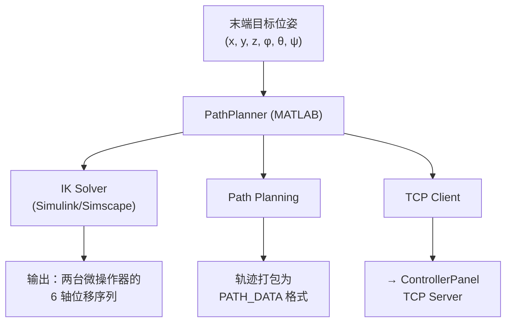
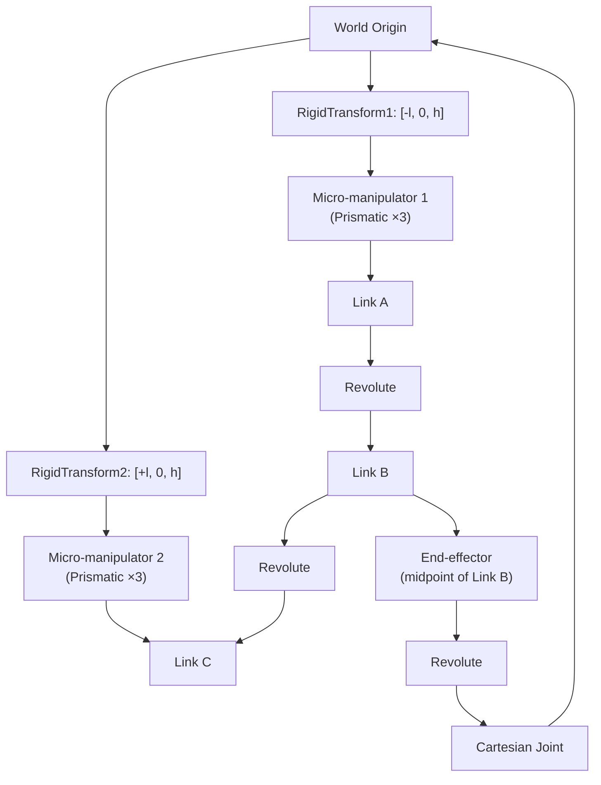
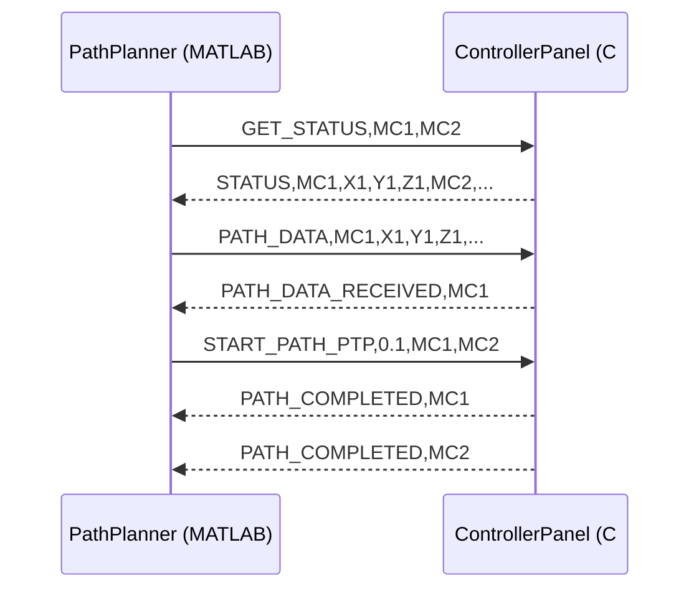

# PathPlanner · 运动学解算与路径规划

> MATLAB/Simulink 客户端。负责闭环并联机构的 IK/FK 运动学解算、末端执行器轨迹生成，并通过 TCP 与 ControllerPanel 协同完成路径执行。

---

## 1. 系统定位

PathPlanner 是 MRE 模块化机器人软件栈的 **算法核心层**，承担三个关键职责：

1. **运动学解算** — 给定末端执行器目标位姿，求解两台 MicroSupport 微操作器的输入位移
2. **路径规划** — 将离散的目标位姿序列转化为平滑可执行的轨迹
3. **通信协同** — 通过 TCP 协议向 ControllerPanel 下发轨迹数据并触发执行



---

## 2. 机构运动学模型

### 2.1 机构拓扑

- **类型：** 平面闭链 3 连杆机构 (Link A–B–C)，等长
- **关节：** 2 个被动转动关节 (A–B 间、B–C 间)
- **驱动：** 2 台 3-DOF 微操作器分别挂载于 Link A 和 Link C 的中点
- **末端：** 挂载于 Link B 中点，可作 RCM (Remote Center of Motion) 运动
- **操作针尖：** 位于原点 `[0, 0, 0]`，末端安装点 `[0, 0, h]`

### 2.2 坐标系定义

| 轴 | 方向 | 说明 |
|------|------|------|
| x+ | 针尖方向 | 指向操作目标 |
| y+ | 纸面法线方向 | — |
| z+ | 向上 | 垂直于基座平面 |

### 2.3 输入 / 输出

| | 内容 | 维度 |
|------|------|------|
| **输入** | 末端执行器目标位姿 $(x_E, y_E, z_E, \phi_E, \theta_E, \psi_E)$ | 6-DOF |
| **输出** | 微操作器 1 位移 $(x_1, y_1, z_1)$ | 3-DOF |
| **输出** | 微操作器 2 位移 $(x_2, y_2, z_2)$ | 3-DOF |

> RCM 模式简化：仅 $x, y, z, \phi$ 可变，$\theta = \psi = 0$。

---

## 3. Simulink 模型架构

### 3.1 核心子系统

| 组件 | 数量 | 说明 |
|------|:--:|------|
| Prismatic Joint | ×6 | 两台微操作器的三轴直线运动 |
| Revolute Joint | ×2 | 连杆 A–B、B–C 间的被动关节 |
| Rigid Transform | ×2 | 将微操作器从世界原点偏移至 Link A/C 中点 |
| Cartesian Joint | ×1 | 末端执行器平移 (XYZ) |
| Revolute Joint | ×1 | 末端执行器绕 X 轴旋转 |

### 3.2 系统连接层次



### 3.3 IK 求解机制

Simulink 采用 **逆向驱动** 策略：

1. 通过 `from workspace` 输入目标末端位姿 `[time, x, y, z, φ, θ, ψ]`
2. 约束末端 Cartesian + Revolute Joint 跟随目标轨迹
3. Simscape 自动计算微操作器 Prismatic Joint 的反应位移
4. 通过 `out.q` 捕获 6 个直线关节的实际位移 `[time, x₁, y₁, z₁, x₂, y₂, z₂]`

> **本质：** 用 Simscape 的正向仿真引擎运行反向求解——给定末端轨迹，反推驱动端位移。避免了显式推导闭链并联机构 IK 解析解的高复杂度。

---

## 4. 配置管理系统

### 4.1 四类参数文件

```
configs/
├── robot_params.m          # 机构几何参数
├── sim_params.m            # 仿真参数
├── controller_params.m     # 控制器参数
└── comm_params.m           # TCP 通信参数
```

### 4.2 关键参数

**robot_params.m** — 机构几何

```matlab
CubeLength = 10;        % 立方体尺寸 [mm]
TipDistance = 20;       % 针尖间距 [mm]
TiltAngle = -pi/4;      % 倾斜角度 [rad]

% 关节限位
X_min = -10; X_max = 10;   % [mm]
Y_min = -10; Y_max = 10;
Z_min = -15; Z_max = 15;
Phi_min = -pi/4; Phi_max = pi/4;   % [rad]
```

**sim_params.m** — 仿真控制

```matlab
SimTime = 0.4;          % 仿真时长 [s]
TimeStep = 0.01;        % 时间步长 [s]
modelFK = 'model_2R_RCM_FK';
modelIK = 'model_2R_RCM_IK';
X0 = 0; Y0 = 0; Z0 = 0; Phi0 = 0;   % 初始位姿
```

**controller_params.m** — 微操作器配置

```matlab
manipulatorID1 = 'MC1';
manipulatorID2 = 'MC2';
ResolutionX = 0.1;      % [μm/pulse]
ResolutionY = 0.1;
ResolutionZ = 0.1;
```

**comm_params.m** — TCP 通信

```matlab
ControllerHost = '127.0.0.1';
ControllerPort = 5000;
ConnectionTimeout = 10;     % [s]
ResponseTimeout = 5;
MaxRetryAttempts = 3;
EnableAutoReconnect = true;
```

---

## 5. PathPlannerClient · MATLAB TCP 客户端

### 5.1 核心工作流

```matlab
% 1. 初始化（自动加载全部配置）
client = PathPlannerClient();

% 2. 连接到 ControllerPanel TCP Server
client.connect();

% 3. 查询微操作器当前状态
status = client.GetStatus('MC1', 'MC2');
% → [(X1,Y1,Z1), (X2,Y2,Z2)]

% 4. 正运动学：从微操作器位置 → 末端位姿
client.onCalcFK();

% 5. 逆运动学：从目标末端位姿 → 微操作器轨迹
trajectory = client.onCalcIK(Xt, Yt, Zt, Phit, Thetat, Psit);
% → N×6 轨迹数组

% 6. 下发路径 + 执行
client.PlanPath('MC1', 'MC2');
client.ExecutePath('MC1', 'MC2');
```

### 5.2 与 ControllerPanel 的 TCP 协议交互



> 完整 TCP 协议规范见 [[2.2 ControllerPanel - 微操作器控制与通信]] § 4。

---

## 6. 关键方法

| 方法 | 作用 |
|------|------|
| `PathPlannerClient()` | 自动加载全部配置，创建客户端实例 |
| `connect()` | 建立到 ControllerPanel 的 TCP 连接 |
| `GetStatus(id1, id2)` | 读取微操作器当前位置 (中心坐标系) |
| `onCalcFK()` | 正运动学：微操作器位置 → 末端位姿 |
| `onCalcIK(Xt,...,Psit)` | 逆运动学：目标末端位姿 → 轨迹数组 |
| `PlanPath(id1, id2)` | 打包轨迹为 PATH_DATA 并下发 |
| `ExecutePath(id1, id2)` | 触发 PTP/CP 路径执行 |
| `updateConfiguration(...)` | 运行时更新配置参数 |
| `reloadConfiguration()` | 重新加载全部配置文件 |

---

## 🔗 关联

- 下游：[[2.2 ControllerPanel - 微操作器控制与通信]] — TCP 通信对端
- 上游：MRE 第二版 Hypercube 物理机构 → [[../0. 工程概述]]
- 应用：果蝇胚胎自动化显微操作 → [[../../3. Applications/3.2 果蝇胚胎显微注射/]]
