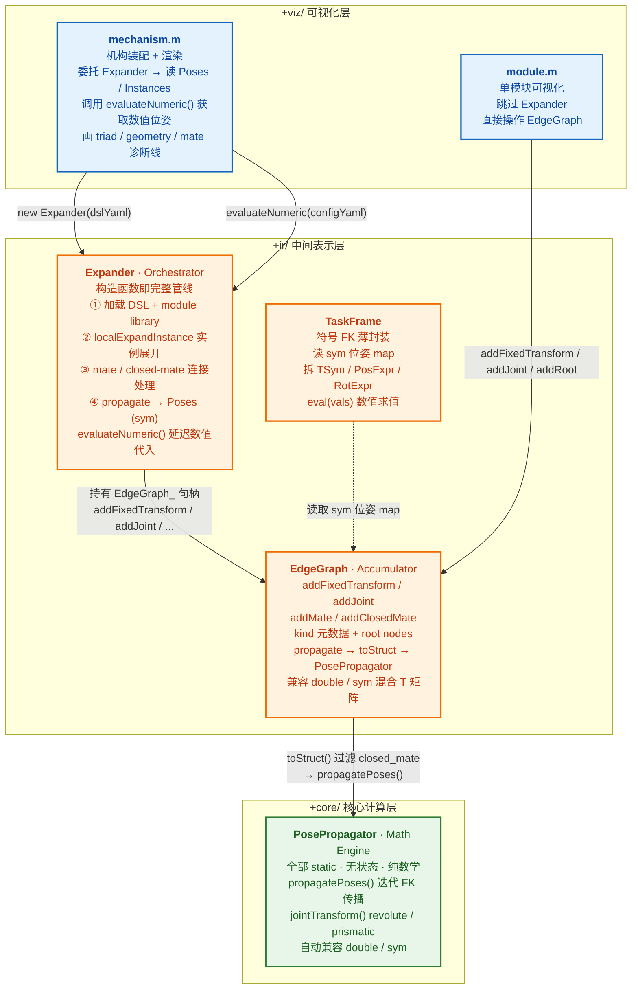
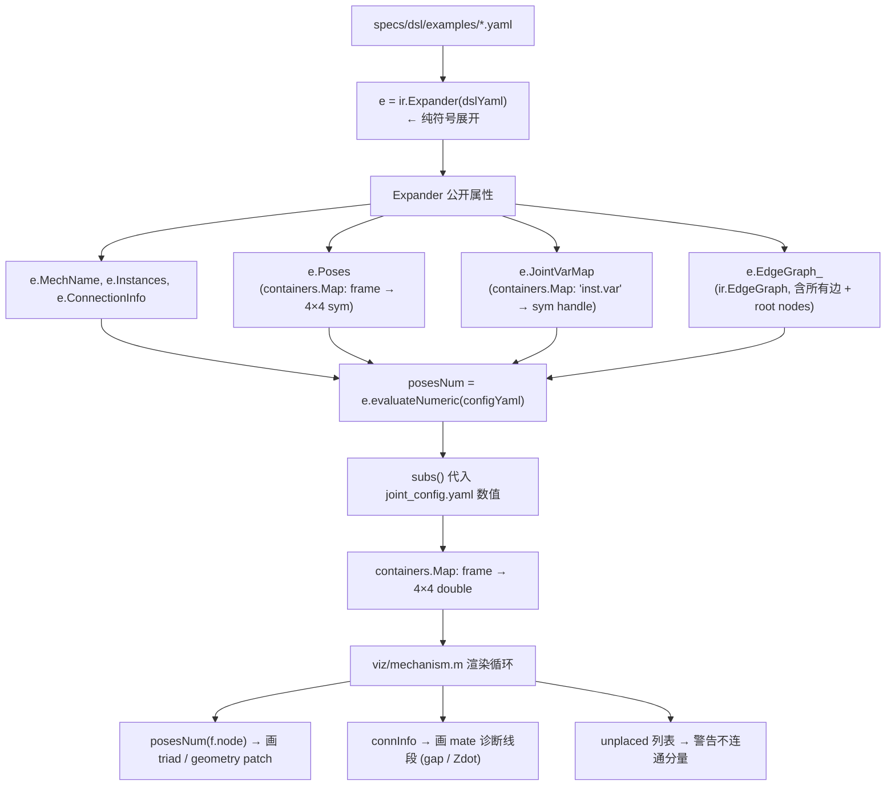
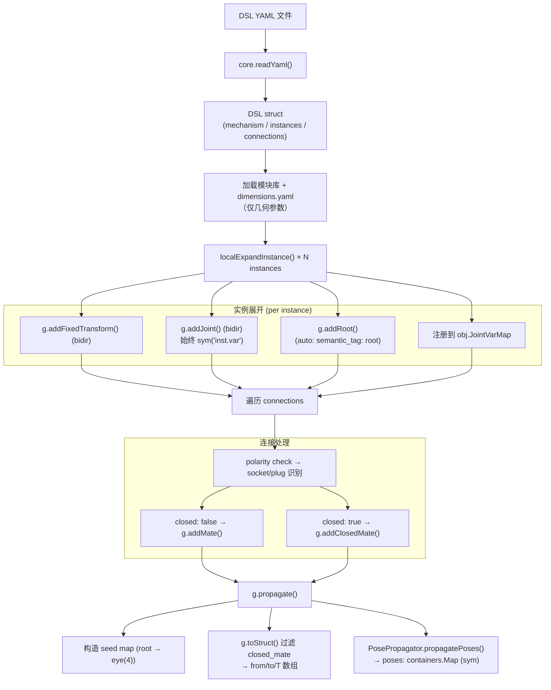
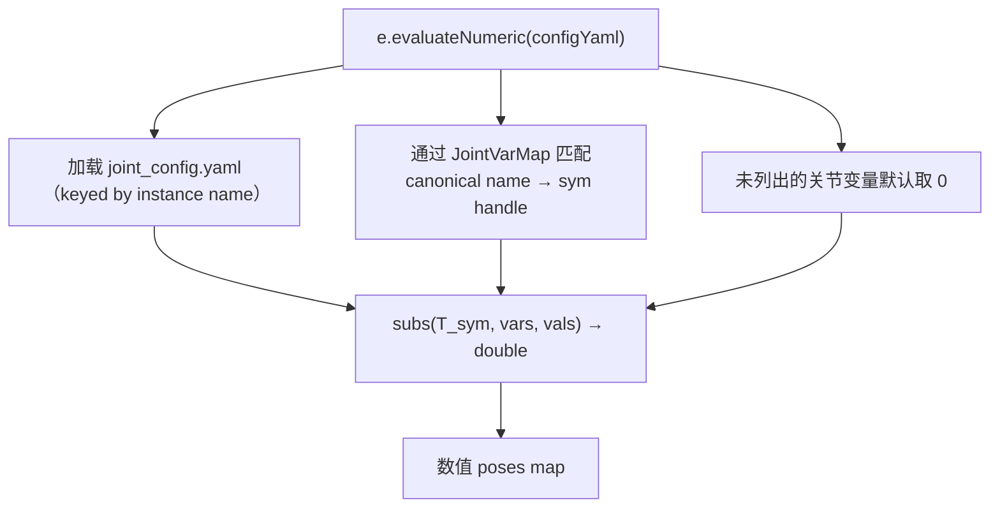
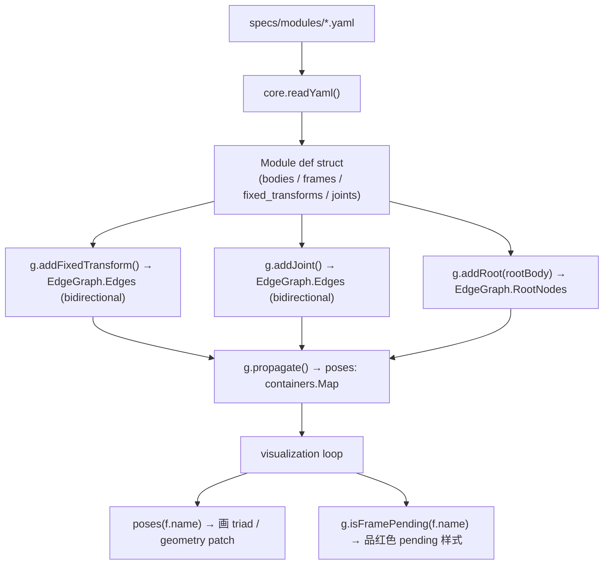
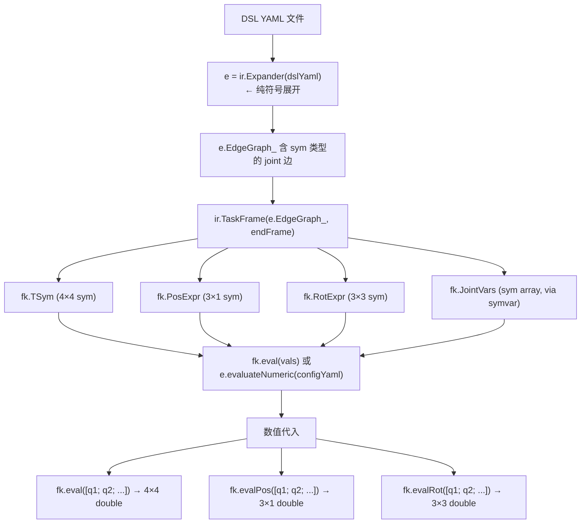

# scripts/matlab — 四层架构设计

> 本文档解释 `+core` / `+ir` / `+viz` 三层（外加调用脚本层）之间的职责划分与数据流。

## 架构总览

项目采用**四层架构**，自上而下为：可视化层 → 中间表示层（编排 + 图累积 + 符号 FK）→ 核心计算层。`TaskFrame` 作为符号 FK 的侧路入口，直接读取图累积层的符号位姿。



> **层间调用链**（编号对应上图）：
> 1. `mechanism.m` 构造 `Expander(dslYaml)` → 构造函数内自动完成 DSL→IR 符号展开和 FK 传播
> 2. 渲染前调用 `e.evaluateNumeric(configYaml)` → 将符号位姿代入关节数值，得到 `double` 位姿 map
> 3. `Expander` 内部持有 `EdgeGraph_` 句柄，所有实例展开/连接处理均写入该图
> 4. `EdgeGraph.propagate()` 委托 `PosePropagator.propagatePoses()` 执行纯数学 FK
> 5. `TaskFrame` 是符号 FK 的独立入口：直接读取 `EdgeGraph` 的 sym 位姿，不经过 Expander
> 6. `module.m` 跳过 Expander，直接调用 `EdgeGraph` 方法构建单模块内部图

## 各层职责

### 可视化层：`+viz/mechanism.m`, `+viz/module.m`

- `mechanism.m`：委托 `ir.Expander` 完成 DSL→IR 符号展开，调用 `e.evaluateNumeric(configYaml)` 将符号位姿代入数值后渲染。自身**只读** `e.Poses`（符号）、`e.Instances`、`e.ConnectionInfo` 等公开属性
- `module.m`：单模块可视化，直接调用 `ir.EdgeGraph` 方法构建模块内部图（不经过 Expander），仍使用数值管线
- 渲染 triad（RGB 坐标三轴）、geometry patch（STEP/STL 几何）、mate 诊断线、关节轴高亮
- **不直接调用 `core.PosePropagator` 的任何方法** — FK 交互通过 `EdgeGraph.propagate()` 完成

### 编排层：`+ir/Expander` (handle class，A.3.0 新增，A.4.0 纯符号化)

- **为什么独立为编排层**：原先 DSL 解析、实例展开、参数注入、连接处理全部内嵌在 `+viz/mechanism.m` 的 setup 区段和 local functions 中。A.3.0 将其抽离为独立的 `ir.Expander`，使可视化层变为纯消费者，符号管线（`TaskFrame`）也可复用同一套展开逻辑。
- **为什么是 handle class**：与 `EdgeGraph` 同理——内部持有 `EdgeGraph_` 和 `DefCache_` 两个可变状态，handle 语义避免在多步展开中反复传入传出。
- **A.4.0 纯符号化**：移除了 `symbolicMode` 开关，关节变量**始终**创建为 `sym` 对象，`Poses` 始终为符号位姿 map。数值代入推迟到调用 `evaluateNumeric(configYaml)` 时执行。
- `Expander(dslYaml, configYaml)`：构造函数即运行完整管线：
  1. 路径解析 + DSL 加载与校验
  2. 模块库路径解析 + 几何参数加载（`dimensions.yaml`，keyed by `module_type`）
  3. 保存 `configYaml` 路径到 `DefaultConfigPath_`（供 `evaluateNumeric` 默认使用）
  4. 实例展开（`localExpandInstance`，private）：加载模块 YAML → 注入几何参数 → 展开 bodies/frames/fixed_transforms/joints（joint 变量始终为 `sym`）→ 名前缀 → 写入 `EdgeGraph_`
  5. 连接处理：极性校验 → 区分 `addMate`（生成树）和 `addClosedMate`（弦边）
  6. Root fallback + FK 传播 → `Poses` map（含 `sym` 位姿）
- `evaluateNumeric(configYaml)`：公开方法，将 `Poses` 中的 `sym` 位姿代入数值 joint 值，返回 `containers.Map`（frame → 4×4 double）。未在 config 中列出的关节变量默认取 0。
- **公开属性**：`MechName`、`Instances`、`ConnectionInfo`、`Poses`（sym）、`LibDir`、`JointVarMap`（canonical name → sym handle）、`EdgeGraph_`

### 图累积层：`+ir/EdgeGraph` (handle class)

- **为什么是 handle class**：MATLAB 的值语义会使多函数调用中的累加器需要反复传入传出。handle class 支持原地修改，调用点干净。
- 封装所有边创建逻辑（固定变换、关节、mate、closed-mate），自动插入双向边
- 管理元数据（`kind`: `fixed` / `joint` / `mate` / `closed_mate`）
- 管理 root nodes（多根支持）
- **支持混合 `double`/`sym` T 矩阵**：MATLAB 的 `*`、`sin`、`cos` 等运算符对 `sym` 多态，`EdgeGraph` 无需区分数值/符号模式即可承载两种管道。
- `propagate()` 方法：
  1. 从 `RootNodes` 构造 seed map（含 fallback 逻辑：无 root node 时用第一条边的 from 作为根）
  2. 调用 `toStruct()` 剥离 `kind` 字段并过滤 `closed_mate`
  3. 委托 `PosePropagator.propagatePoses()` 执行 FK

### 符号 FK 层：`+ir/TaskFrame` (handle class，A.3.2 新增)

- 薄封装：不重复 FK 传播逻辑，直接读取符号 `EdgeGraph` 的 `propagate()` 输出
- `TaskFrame(edgeGraph, endFrame)`：从 pose map 中抽取 `endFrame` 的 4×4 `sym` 位姿，拆解为 `TSym` / `PosExpr` / `RotExpr`，通过 `symvar()` 自动提取 `JointVars`
- `eval(vals)`：代入数值 joint 值，返回 4×4 double
- `evalPos(vals)` / `evalRot(vals)`：分别返回位置和旋转分量

### 计算层：`+core/PosePropagator` (全部 static)

- **无状态，纯数学**：输入边 + 种子位姿 → 输出全局位姿 map
- `propagatePoses(edges, seed)`: 迭代 FK 传播（支持多根、支持环路悬空节点，自动兼容 `double`/`sym`）
- `jointTransform(kind, axis, value)`: 构造 revolute / prismatic 关节的 4×4 齐次变换（`value` 为 `double` 时输出 `double`，为 `sym` 时输出 `sym`——Rodrigues 公式中的 `sin`/`cos` 对 `sym` 多态）

## 数据流

### mechanism.m 路径（机构装配 + 可视化，A.4.0 纯符号）



### Expander 内部管线（构造函数内完成，A.4.0）



数值化（延迟到渲染/求解时）：



### module.m 路径（单模块可视化）



`module.m` 路径是 `mechanism.m` 的简化版：不经过 Expander（无多实例拼接、无 inter-instance mate 边），直接操作 EdgeGraph。单根（第一个 body）。

### 符号 FK 路径（A.3.2 新增，A.4.0 适配）



## 关键设计决策

### 1. `toStruct()` 剥离元数据

`EdgeGraph.Edges` 内部包含 `kind` 和 `pending` 字段，但 FK 引擎 (`PosePropagator.propagatePoses`) 只需要 `from` / `to` / `T`。`toStruct()` 负责剥离多余字段，保持 FK 引擎接口简洁。

### 2. Pending 追踪

- 存储：每条 fixed-transform 边在 `EdgeGraph` 中以 `pending` 字段标记（当旋转为占位 align 规则时）
- 查询：通过 `g.isFramePending(nodeName)` 方法，遍历所有边查找目标节点是否被 pending 边指向
- 可视化：pending 帧用品红色虚线 triad + `(pending R)` 标签渲染
- 不通过 `toStruct()` 暴露 `pending` 字段（保持 FK 引擎纯净）

### 3. Mate 约定

参见 `specs/dsl/connection-semantics.md`：
```
T_plug←socket = Rz(roll × 2π / symmetry) × Rx(π),  t = 0
```
- `addMate(socket, plug, roll, sym)`: 插入双向边，用于 FK 传播（spanning tree edge）
- `addClosedMate(socket, plug, roll, sym)`: 仅插入单向边，不参与 FK 传播（chord / 环路切割边），仅用于诊断环路闭合残差

### 4. 多根支持

`EdgeGraph` 支持多次调用 `addRoot()` 注册多个 root frame。在 `propagate()` 中所有 root frame 以 `eye(4)` 为初始位姿。这支持多分支 / 并联机构。

### 5. 为什么 `Expander` 独立于 `+viz`

| 维度 | Expander | +viz/mechanism.m |
|------|----------|------------------|
| 状态 | handle class，有状态（EdgeGraph_、DefCache_） | function，无状态 |
| 职责 | DSL→IR 展开、参数注入、图构建、FK 传播 | 纯渲染：triad、geometry、诊断线 |
| 消费者 | `+viz/mechanism.m`（数值）、`+ir/TaskFrame`（符号） | 终端用户 |
| 变更原因 | DSL 语法演进、新模块类型、符号变量管线 | 渲染样式、新几何格式 |

A.3.0 之前，DSL 解析和 EdgeGraph 构建逻辑全部内嵌在 `+viz/mechanism.m` 的 setup 区段和 local functions 中。
抽离为独立 `Expander` 后：
- 可视化层退化为纯消费者（只读 public 属性）
- `TaskFrame` 可复用同一套展开逻辑——Expander 始终产生符号位姿，无需模式切换
- 测试可以独立构造 Expander，不启动图形窗口

### 6. 为什么 `TaskFrame` 是薄封装而非独立引擎

`TaskFrame` 不重复 FK 传播逻辑。它依赖两个已有事实：
1. `EdgeGraph` 的 `propagate()` 对 `sym` T 矩阵透明（MATLAB 多态运算符）
2. `Expander` 已将 joint 边构建为符号变换（A.4.0 纯符号化）

因此 `TaskFrame` 的唯一增量工作是：从 `propagate()` 生成的 pose map 中抽取 `endFrame` 的符号位姿并拆解。
这种设计避免了符号管道和数值管道的代码分叉——同一套 `EdgeGraph` + `PosePropagator` 服务于两种模式。

### 7. 为什么 `PosePropagator` 保持独立

| 维度 | EdgeGraph | PosePropagator |
|------|-----------|-----------|
| 状态 | handle class，有状态 | 全部 static，无状态 |
| 职责 | 累积边、管理元数据 | 纯数学计算 |
| 变更原因 | DSL 格式变化、新边类型 | FK 算法改进、新关节类型 |
| 可测试性 | 需要构造完整对象 | 给定输入即得输出 |

合并会违反单一职责原则，降低可测试性。保持分层使得每层可以独立演进和测试。

## 运动学核心概念

DSL→IR 展开由 `ir.Expander` 完成，可视化层仅消费展开结果。以下为核心机制的简要概述，详细规范见 IR 文档：

| 概念 | 概述 | 权威文档 |
|------|------|------|
| **生成树 + 弦边** | 闭环机构用生成树边（`addMate`，双向）传播 FK；弦边（`addClosedMate`，单向）仅用于诊断闭环残差 | `edge-types.md` §4–§5, `port-attachment.md` |
| **Mate 变换** | $T = R_z(\text{roll}) \cdot R_x(\pi), t=0$ — socket→plug 方向，双向插入时逆向取 $T^{-1}$ | `connection-semantics.md` §2, `port-attachment.md` §2 |
| **`kind` 过滤** | `toStruct()` 排除 `closed_mate` 边后再传给 FK 引擎，确保弦边不参与位姿传播 | `edge-types.md` §6 |
| **Root node** | `semantic_tag: root` 的 frame 自动注册；无 root 时 fallback 到第一个 body。`ground` 标签不触发 root 注册 | `node-types.md` §3.4 |
| **FK 传播** | `PosePropagator.propagatePoses` — 迭代传播：从 seed 帧沿边 `from→to` 累积 $T$，遍历全部边直至收敛。自动兼容 `double`/`sym` | `edge-types.md` §6–§7 |
| **特征尺度** | 可视化元素尺寸按 $L = \max(4, 0.20 \times \max\|\mathbf{p}_i\|)$ 自动适配 | 本文档（实现特有） |
| **Mate 诊断** | gap = $\|\mathbf{p}_s - \mathbf{p}_p\|$（理想 0）；Zdot = $\mathbf{z}_s \cdot \mathbf{z}_p$（理想 -1） | `port-attachment.md` §7 |

> 完整的「DSL YAML → IR 图 → FK 位姿 → 3D 渲染」端到端流水线图见 `dsl-to-ir-mapping.md` §1。
