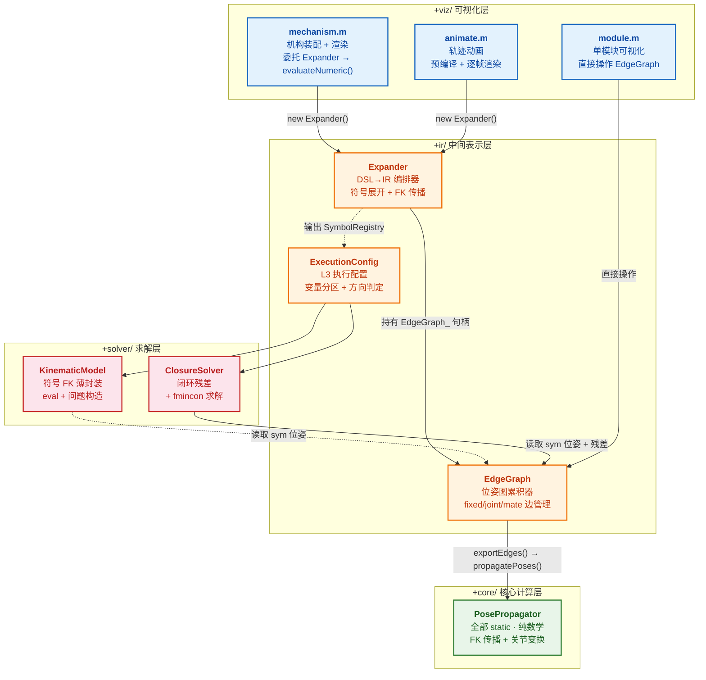
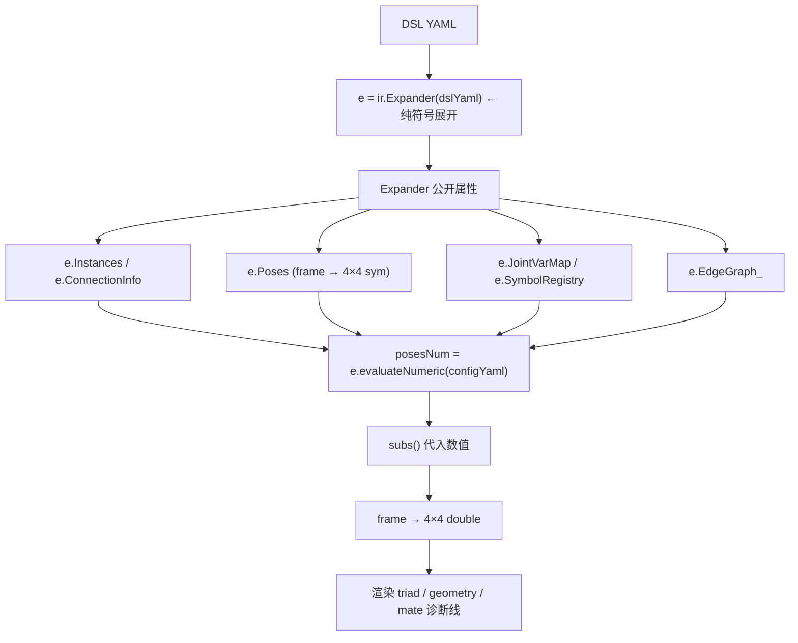
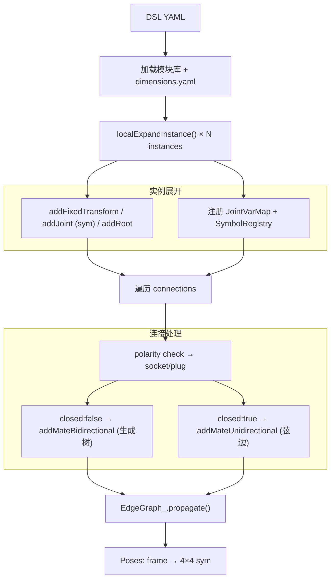
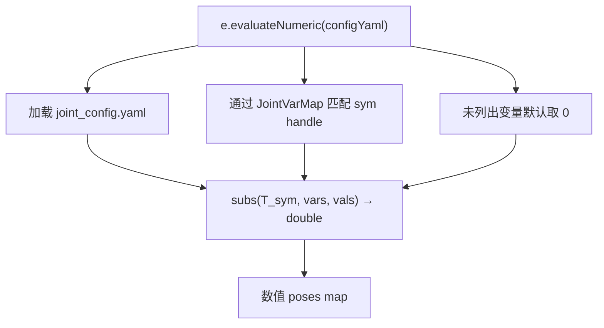
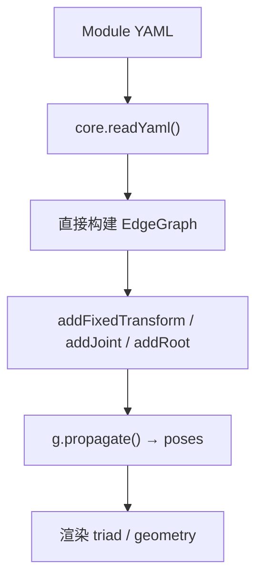
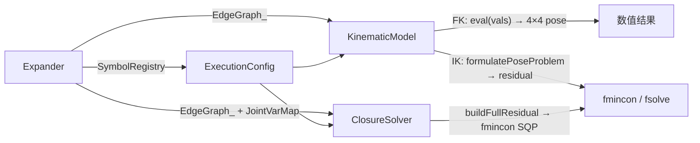

# scripts/matlab — 四层架构设计

> 本文档解释 `+core` / `+ir` / `+viz` / `+solver` 四层之间的职责划分与数据流。
> 各类的详细属性、方法签名、使用示例请参见 **[API_REFERENCE.md](./API_REFERENCE.md)**。

## 架构总览

```mermaid
graph TB
    %% ── 样式定义 ──
    classDef viz fill:#e3f2fd,stroke:#1565c0,stroke-width:2px,color:#0d47a1
    classDef ir  fill:#fff3e0,stroke:#ef6c00,stroke-width:2px,color:#bf360c
    classDef solver fill:#fce4ec,stroke:#c62828,stroke-width:2px,color:#b71c1c
    classDef core fill:#e8f5e9,stroke:#2e7d32,stroke-width:2px,color:#1b5e20

    %% ── 可视化层 ──
    subgraph viz_layer["+viz/ 可视化层"]
        direction LR
        mech["<b>mechanism.m</b><br/>机构装配 + 渲染<br/>委托 Expander → evaluateNumeric()"]
        mod["<b>module.m</b><br/>单模块可视化<br/>直接操作 EdgeGraph"]
        anim["<b>animate.m</b><br/>轨迹动画<br/>预编译 + 逐帧渲染"]
    end

    %% ── 中间表示层 ──
    subgraph ir_layer["+ir/ 中间表示层"]
        direction LR
        expander["<b>Expander</b><br/>DSL→IR 编排器<br/>符号展开 + FK 传播"]
        edgegraph["<b>EdgeGraph</b><br/>位姿图累积器<br/>fixed/joint/mate 边管理"]
        execcfg["<b>ExecutionConfig</b><br/>L3 执行配置<br/>变量分区 + 方向判定"]
    end

    %% ── 求解层 ──
    subgraph solver_layer["+solver/ 求解层"]
        direction LR
        kinmodel["<b>KinematicModel</b><br/>符号 FK 薄封装<br/>eval + 问题构造"]
        closuresolver["<b>ClosureSolver</b><br/>闭环残差<br/>+ fmincon 求解"]
    end

    %% ── 核心计算层 ──
    subgraph core_layer["+core/ 核心计算层"]
        poseprop["<b>PosePropagator</b><br/>全部 static · 纯数学<br/>FK 传播 + 关节变换"]
    end

    %% ── 调用关系 ──
    mech & anim -->|"new Expander()"| expander
    expander   -->|"持有 EdgeGraph_ 句柄"| edgegraph
    edgegraph  -->|"exportEdges() → propagatePoses()"| poseprop
    expander   -.->|"输出 SymbolRegistry"| execcfg
    execcfg    --> kinmodel
    execcfg    --> closuresolver
    kinmodel   -.->|"读取 sym 位姿"| edgegraph
    closuresolver -->|"读取 sym 位姿 + 残差"| edgegraph
    mod        -->|"直接操作"| edgegraph

    class mech,mod,anim viz
    class expander,edgegraph,execcfg ir
    class kinmodel,closuresolver solver
    class poseprop core
```

> **层间调用链**：
> 1. `mechanism.m` / `animate.m` 构造 `Expander(dslYaml)` → 构造函数自动完成 DSL→IR 符号展开和 FK 传播
> 2. 渲染前调用 `e.evaluateNumeric()` → `sym` 位姿 → `double` 位姿
> 3. `Expander` 内部持有 `EdgeGraph_` 句柄，所有实例展开/连接处理均写入该图
> 4. `EdgeGraph.propagate()` 委托 `PosePropagator.propagatePoses()` 执行纯数学 FK
> 5. `module.m` 跳过 Expander，直接调用 `EdgeGraph` 方法构建单模块内部图
> 6. `Expander` 输出 `SymbolRegistry` → `ExecutionConfig` 交叉校验
> 7. `KinematicModel` 是符号 FK 的独立入口，直接读取 `EdgeGraph` 传播结果
> 8. `ClosureSolver` 从 `EdgeGraph` 取符号位姿构建闭环残差，通过 `fmincon` 求解

## 各层职责

### 可视化层 (`+viz/`)

- **`mechanism.m`**: 委托 `ir.Expander` 完成符号展开，调用 `evaluateNumeric()` 代入数值后渲染 triad / geometry / mate 诊断线。自身只读 Expander 的公开属性。
- **`module.m`**: 单模块可视化，直接调用 `ir.EdgeGraph` 方法（不经过 Expander），使用数值管线。
- **`animate.m`**: 轨迹动画，构建一次 Expander → 预编译位姿函数 → 逐帧代入数值渲染，支持播放控件。
- **`allModules.m`**: 批量校验所有模块 YAML。

> 详见 [API_REFERENCE.md § +viz/](./API_REFERENCE.md#viz-可视化层)

### 中间表示层 (`+ir/`)

- **`Expander`** (handle class): DSL→IR 编排器。构造函数即完整管线：加载 DSL + 模块库 → 实例展开 → 连接处理 → FK 传播 → 输出 `Poses`（符号）和 `SymbolRegistry`。A.4.0 起关节变量始终为 `sym`，数值代入推迟到 `evaluateNumeric()`。
- **`EdgeGraph`** (handle class): 位姿图累积器。管理 `fixed` / `joint` / `mate` / `closed_mate` 四种边，支撑混合 `double`/`sym` T 矩阵，桥接 `PosePropagator`。
- **`ExecutionConfig`** (value class): L3 执行配置，加载 YAML → Schema 校验 → 交叉验证 `SymbolRegistry` → 变量分区（known/unknown）→ 求解方向判定（FK/IK）。

> 详见 [API_REFERENCE.md § +ir/](./API_REFERENCE.md#ir-中间表示层)

### 求解层 (`+solver/`)

- **`KinematicModel`** (handle class): 符号 FK 薄封装。从 `EdgeGraph` 抽取末端 frame 的 `TSym` → 拆解 `PosExpr` / `RotExpr` → 提供 `eval(vals)` 和 `formulatePoseProblem(cfg)`。
- **`ClosureSolver`** (handle class): 闭环约束构造器。对每个 closure cut 构建 6-DOF 符号残差 → `matlabFunction` 编译 → `fmincon` SQP 求解 IK。

> 详见 [API_REFERENCE.md § +solver/](./API_REFERENCE.md#solver-求解层)

### 核心计算层 (`+core/`)

- **`PosePropagator`** (全部 static): 无状态纯数学引擎。`propagatePoses(edges, seed)` 迭代 FK 传播（支持多根、混合 `double`/`sym`）；`jointTransform(kind, axis, value)` 构造关节变换矩阵。
- **`RigidBodyMath`** (全部 static): 3D 刚体变换原语（T 矩阵合成、轴角、RPY、对齐旋转）。
- **`CommonUtils`** (全部 static): 参数表达式求值、YAML 列表展开、struct 字段安全读取。
- **`PathUtils`** / **`VizHelpers`** / **`readYaml`**: 路径解析、渲染辅助、极简 YAML 解析。

## 数据流

### mechanism.m 路径（A.4.0 纯符号）

```mermaid
flowchart TD
    A["DSL YAML"] --> B["e = ir.Expander(dslYaml) ← 纯符号展开"]
    B --> C["Expander 公开属性"]
    C --> D1["e.Instances / e.ConnectionInfo"]
    C --> D2["e.Poses (frame → 4×4 sym)"]
    C --> D3["e.JointVarMap / e.SymbolRegistry"]
    C --> D4["e.EdgeGraph_"]
    D1 & D2 & D3 & D4 --> E["posesNum = e.evaluateNumeric(configYaml)"]
    E --> F["subs() 代入数值"]
    F --> G["frame → 4×4 double"]
    G --> H["渲染 triad / geometry / mate 诊断线"]
```

### Expander 内部管线（构造函数内完成）

```mermaid
flowchart TD
    A["DSL YAML"] --> B["加载模块库 + dimensions.yaml"]
    B --> C["localExpandInstance() × N instances"]
    subgraph expand["实例展开"]
        E1["addFixedTransform / addJoint (sym) / addRoot"]
        E2["注册 JointVarMap + SymbolRegistry"]
    end
    C --> E1
    C --> E2
    E1 & E2 --> F["遍历 connections"]
    subgraph conn["连接处理"]
        F1["polarity check → socket/plug"]
        F2["closed:false → addMateBidirectional (生成树)"]
        F3["closed:true → addMateUnidirectional (弦边)"]
    end
    F --> F1 --> F2
    F1 --> F3
    F2 & F3 --> G["EdgeGraph_.propagate()"]
    G --> H["Poses: frame → 4×4 sym"]
```

### 数值化（延迟到渲染/求解时）

```mermaid
flowchart TD
    A["e.evaluateNumeric(configYaml)"] --> B["加载 joint_config.yaml"]
    A --> C["通过 JointVarMap 匹配 sym handle"]
    A --> D["未列出变量默认取 0"]
    B & C & D --> E["subs(T_sym, vars, vals) → double"]
    E --> F["数值 poses map"]
```

### module.m 路径（单模块）

```mermaid
flowchart TD
    A["Module YAML"] --> B["core.readYaml()"]
    B --> C["直接构建 EdgeGraph"]
    C --> D1["addFixedTransform / addJoint / addRoot"]
    D1 --> E["g.propagate() → poses"]
    E --> F["渲染 triad / geometry"]
```

### 符号→求解路径

```mermaid
flowchart LR
    A["Expander"] -->|"SymbolRegistry"| B["ExecutionConfig"]
    A -->|"EdgeGraph_"| C["KinematicModel"]
    A -->|"EdgeGraph_ + JointVarMap"| D["ClosureSolver"]
    B --> C
    B --> D
    C -->|"FK: eval(vals) → 4×4 pose"| E["数值结果"]
    C -->|"IK: formulatePoseProblem → residual"| F["fmincon / fsolve"]
    D -->|"buildFullResidual → fmincon SQP"| F
```

> **求解方向切换**：同一套机构 + 同一套 `KinematicModel`，仅通过更换 execution-config YAML 即可在 FK（open_loop）和 IK（closed_loop）之间切换。`formulatePoseProblem` 根据 known/unknown 分区自动构造对应的数值函数。

## 关键设计决策

### 为什么 EdgeGraph 和 Expander 是 handle class

MATLAB 值语义会在多函数调用中强制传入传出累加器。handle class 支持原地修改，调用点干净。
`EdgeGraph` 在 `Expander.localExpandInstance` 中被反复追加边；`Expander` 自身持有 `EdgeGraph_` 和 `DefCache_` 两个可变状态。

### 为什么 ExecutionConfig 是 value class

配置是不可变数据——构造后即冻结，value 语义更安全，避免意外共享修改。

### 为什么 PosePropagator 全部 static

FK 传播是无状态的纯数学运算——输入边 + 种子位姿 → 输出全局位姿 map。static 方法消除不必要的对象开销。

### 符号/数值分离 (A.4.0)

Expander 构造函数**始终**产生符号位姿（`Poses` 为 `frame → 4×4 sym`）。数值代入延迟到 `evaluateNumeric()` 时。这使同一份符号展开结果可被多次数值化（不同配置、动画逐帧），且 `KinematicModel` 和 `ClosureSolver` 可直接消费符号表达式。

### closed_mate 与闭环处理

- `addMateBidirectional`（双向）: 生成树边，参与 FK 传播
- `addMateUnidirectional`（单向）: 闭环弦边，`exportEdges()` 排除，不参与 FK 传播，仅用于诊断残差
- `ClosureSolver` 读取 `ExecutionConfig.ClosureCuts`（可来自 YAML 显式声明或从 `closed_mate` 自动推导），重新传播符号位姿后构建闭环残差
