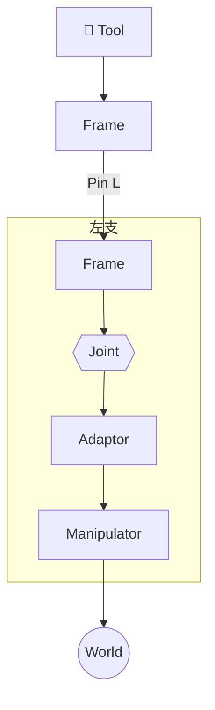

# DSL 案例规范

每个机构案例放在 `specs/dsl/cases/<case-name>/` 目录下。

## 目录结构

```
<case-name>/
├── robot_description.yaml    # [必需] 机构装配 DSL 文件
├── joint_config.yaml         # [可选] 关节变量/参数赋值配置
└── README.md                 # [推荐] 人类可读的机构文档
```

### robot_description.yaml

符合 `mechanism-assembly.schema.yaml` 的 DSL 文件。头部注释应精简：

```yaml
# yaml-language-server: $schema=../../schema/mechanism-assembly.schema.yaml
# <一句话描述机构> — 详细文档见同目录 README.md

dsl_version: 0
mechanism: <name>
description: <一句话概述>
module_library: ../../../modules/

instances:
  # ...

connections:
  # ...
```

详细的结构说明、拓扑图、变量表等一律放在 README.md 中，不在 YAML 头部重复。

### joint_config.yaml

可选的参数赋值文件，格式为 `实例名.变量名: 值`。若不提供，所有关节变量默认取 0（零位）。

### README.md

机构文档，推荐包含以下章节：

| 章节 | 内容 | 必需？ |
|------|------|--------|
| 标题 + 一句话概述 | 机构名称、类型、验证阶段 | ✅ 必需 |
| 结构概述 | 2-5 句描述机构组成、驱动方式、闭环/开链类型 | ✅ 必需 |
| 装配流程图 | TD 向 Mermaid `flowchart`，按 [§ 绘制规则](#装配流程图绘制规则) 绘制 | ✅ 必需 |
| 符号变量表 | 实例限定名、含义、单位、属性（observable / known / unknown） | 推荐 |
| 说明 / 备注 | L3 执行层绑定说明、零位条件等 | 按需 |

## 装配流程图绘制规则

以下 7 条规则适用于任意模块化机构的装配流程图，与具体 DSL 无关。

| # | 规则 | 说明 |
|---|------|------|
| 1 | **工具置顶** | 以末端执行器为**根节点**，置于图表顶部中央。若无显式工具，则以最后一个 Frame 或观测帧为根。 |
| 2 | **Joint 为行分隔** | 每个运动副独占一个水平层。所有 Joint 通过不可见边（`~~~`）对齐到同一「关节层」，形成视觉分隔线。 |
| 3 | **刚性段纵向堆叠** | Joint 层之间的纯刚性模块（Frame、Adaptor）按连接顺序纵向堆叠。Joint **上方**为「工具侧」刚性链，**下方**为「驱动侧」刚性链。**Pin（销钉连接件）不作为节点出现**，而是标注在连接边上（`-->|Pin N|`）——Pin 仅传递位姿，不引入自由度或独立几何体。 |
| 4 | **分支横向展开** | 当一个模块连接多个下游模块时，分支横向展开。**多支链机构（闭链/并联）必须使用 `subgraph` 将各支链封装为独立布局单元**，配合 `direction TB` 保证支链内部自上而下、支链之间左右严格对称，避免 Mermaid 自动布局导致的节点错位和箭头交叉。 |
| 5 | **驱动置底** | 驱动模块置于每条运动链的最底层。多驱动时横向对齐到同一行。 |
| 6 | **闭环收束** | 所有驱动的 ground frame 最终收束到同一个 `((World / Ground))` 圆形节点。开链：一个驱动 → ground；闭链/并联：多个驱动 → 同一 ground。 |
| 7 | **流向自上而下** | 图方向为 TD。物理含义：从末端执行器出发，沿运动链向驱动基座追溯，最终汇入 world 系。 |

### Mermaid 语法要点

多支链机构必须用 `subgraph` 分组以保证对称。骨架模板：



关键点：subgraph 封装每支链 / Pin 始终为边标注（`-->|Pin N|`）/ 跨 subgraph 用 `~~~` 对齐同行节点。完整案例参考 `open-chain-2r/`。

### 节点形状约定

| 形状 | Mermaid 语法 | 用于 |
|------|-------------|------|
| 方框 | `[label]` | Frame、Adaptor 等刚性模块 |
| 六边形 | `{{label}}` | Joint（revolute / prismatic） |
| 圆形 | `((label))` | World / Ground（闭环收束点） |
| 矩形 | `[label]` | Manipulator（驱动模块） |
| *边标注* | `-->|label|` | Pin（销钉连接件，仅传位姿，不作为节点） |

## 案例索引

| 案例 | 类型 | 说明 |
|------|------|------|
| [open-chain-2r](./open-chain-2r/) | 开链 | 2R 平面机械臂，最简串联链 |
| [single-closed-loop](./single-closed-loop/) | 单闭环 | 平行四边形机构等单回路闭链 |
| [m-rex-3t1r](./m-rex-3t1r/) | 3T1R 闭链 | 两端 Manipulator 驱动的 M-REx 闭环链，含工具分支 |
