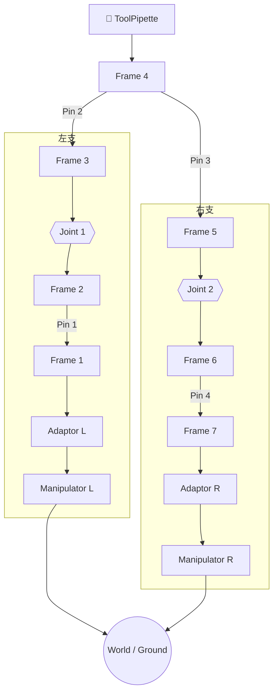

# m-rex-3t1r — 3T1R M-REx 机构

> 阶段 A.2.3 验证目标：两端 Manipulator 驱动的闭环链 FK/IK 传播、多模块串联与分支。

## 结构概述

两端各一个 **Manipulator**（3-DOF 笛卡尔驱动，dx/dy/dz）经 **Adaptor** 接入 M-REx 单元链。中间通过 **Pin**（Connector 销钉连接件）连接 **Frame** 立方体，串联两个 revolute **Joint** 构成主运动链。**ToolPipette** 作为工具末端从 Frame_4 分支，提供 `tip_origin` 观测点。

机构在零位构型下，末端效应器（`ToolPipette.tip_origin`）与世界原点重合（$T=I_4$）；两端 `Manipulator` 的 `ground` frame 各带静态标定偏移绑定到 `world`。Manipulator 关节（dx/dy/dz）在零位时机构自洽，运行时通过调节关节变量来满足末端任务位姿，形成典型的 **3T1R**（三平移一转动）M-REx 构型。

## 装配流程图

> 绘制规则见下方 [§ 绘制规则](#绘制规则)。以下按规则绘制 m-rex-3t1r 的运动链图。

> **阅读方式**：从顶部工具向下看。左右两支用 `subgraph` 分别封装，`direction TB` 保证支链内部自上而下，`~~~` 跨 subgraph 对齐关节层和驱动层。Pin 不作为节点出现，而是标注在连接边上（`-->|Pin N|`）。最底层两个 Manipulator 收束到同一个 `World / Ground` 节点展示**闭环**概念。

---

## 符号变量表

| 变量（实例限定名） | 含义 | 单位 | 属性 |
|---|---|---|---|
| `manipulator_L.dx` | 左驱动 X 轴平移 | mm | observable |
| `manipulator_L.dy` | 左驱动 Y 轴平移 | mm | observable |
| `manipulator_L.dz` | 左驱动 Z 轴平移 | mm | observable |
| `manipulator_R.dx` | 右驱动 X 轴平移 | mm | observable |
| `manipulator_R.dy` | 右驱动 Y 轴平移 | mm | observable |
| `manipulator_R.dz` | 右驱动 Z 轴平移 | mm | observable |
| `joint_1.q` | 第一转动副角度 | rad | observable |
| `joint_2.q` | 第二转动副角度 | rad | observable |
| `pipette.tip_origin` | 工具尖端任务系 | — | observable（FK/IK 输出候选） |

## 说明

- 两端 Manipulator 的 ground frame 如何绑定到 world、哪个 Manipulator 作为驱动/被动、`endFrame` 指定、变量 `known/unknown` 分区均属 **L3 execution-config**，不在本 DSL 中声明。
- 全部关节零位（q=0, dx=dy=dz=0）满足建模约定 §2.4 初始零位条件。
