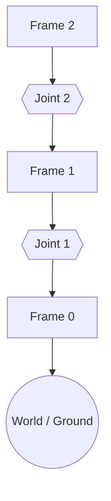

# open-chain-2r — 开环 2R 链

> 阶段 A.2.3 验证目标：变换传播、端口拼接、FK 输出（纯树，无闭环）。

## 结构概述

两段串联 revolute **Joint**，中间用 **Frame** 立方体作为串联枢纽。每个 Joint 的两端口均为 plug，必须贴到 Frame 的 socket 面上。为最简开链机构，无闭环、无 Pin、无工具末端。

## 装配流程图

> **阅读方式**：单链自上而下，Frame 2 → Joint 2 → Frame 1 → Joint 1 → Frame 0，最终接入 World。Joint 1 / Joint 2 各占一行，中间由 Frame 串联。无 Pin（销钉连接件），故无边标注。

## 符号变量表

| 变量（实例限定名） | 含义 | 单位 | 属性 |
|---|---|---|---|
| `joint1.q` | 第一转动副角度 | rad | observable |
| `joint2.q` | 第二转动副角度 | rad | observable |

## 说明

- Frame 0 的 world 绑定、`endFrame` 指定、关节 actuated 指派与 known/unknown 分区均属 **L3 execution-config**，不在本 DSL 中声明。
- 全部关节零位（q=0）满足建模约定 §2.4 初始零位条件。
