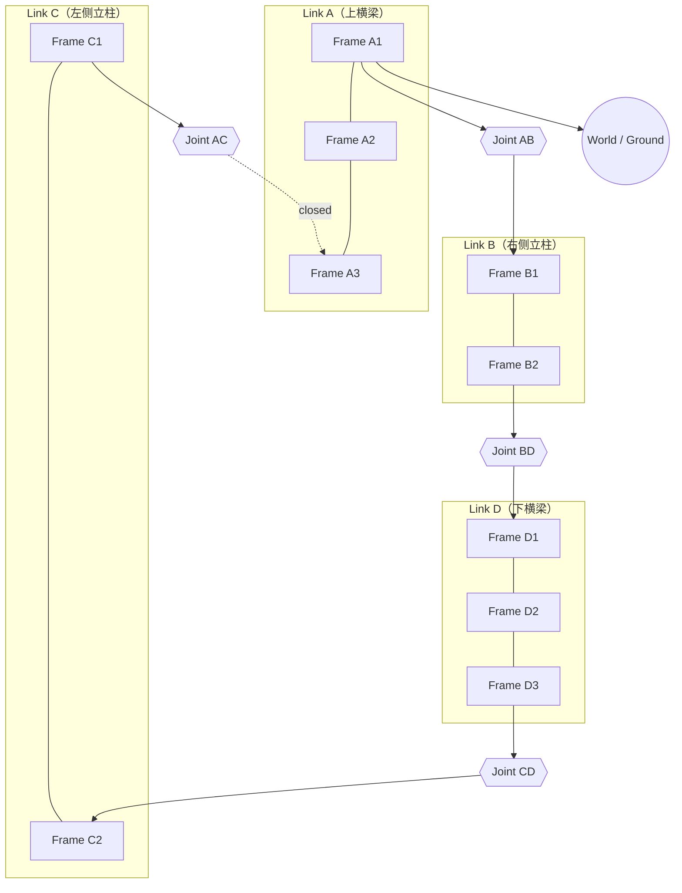

# single-closed-loop — 单闭环平行四边形机构

> 阶段 A.2.3 验证目标：闭环约束提取、未知量识别（L2 内部闭合的平行四边形环）。

## 结构概述

由四根连杆（Link A/B/C/D）经四个转动副（Joint AB/BD/CD/AC）铰接而成的平行四边形闭环机构。
每根连杆由多个 **Frame** 立方体经 **Pin** 销钉串联而成，构成结构上更接近真实机械臂的细长杆件。

- **Link A**（上横梁）：3 个 Frame（A1–A2–A3）沿 Y 轴串联
- **Link B**（右侧立柱）：2 个 Frame（B1–B2）沿 Z 轴串联
- **Link C**（左侧立柱）：2 个 Frame（C1–C2）沿 Z 轴串联
- **Link D**（下横梁）：3 个 Frame（D1–D2–D3）沿 Y 轴串联

**生成树（FK 传播路径）**：A1 → joint_AB → B1 → B2 → joint_BD → D1 → D2 → D3 → joint_CD → C2 → C1。
**补边（chord）**：joint_AC 连接 C1 回 A3，标记 `closed: true`，构成 L2 内部闭合回路。

平行四边形环 DOF = 1：4 个 revolute − 3 个独立平面闭环约束 = 1。

> **roll 配对约定**：每个 Joint 两端连接的 `roll` 必须成对出现（`roll: 1` / `roll: -1`），
> 使得关节轴旋转 90° 对齐平行四边形变形方向，同时下游模块朝向不受影响。
> 详见 `connection-semantics.md` §3.5。

## 装配流程图

> **阅读方式**：生成树（实线）A1 → B1 → D1 → C2 → C1。补边 joint_AC（虚线，`closed`）从 C1 回到 A3，闭合平行四边形环。A1 接地到 World。

## 符号变量表

| 变量（实例限定名） | 含义 | 单位 | 属性 |
|---|---|---|---|
| `joint_AB.q` | 铰点 AB 角度（右上角） | rad | observable |
| `joint_BD.q` | 铰点 BD 角度（右下角） | rad | observable |
| `joint_CD.q` | 铰点 CD 角度（左下角） | rad | observable |
| `joint_AC.q` | 铰点 AC 角度（左上角，补边侧） | rad | observable |

## 说明

- World 绑定（哪根连杆接地）、`endFrame` 指定、已知/未知变量分区、切口归零子集均属 **L3 execution-config**。
- 全部关节零位（q=0）满足建模约定 §2.4 初始零位条件。
- 每个 Joint 两端连接均采用 `roll: 1` / `roll: -1` 配对，使关节旋转轴对齐 X 轴（平行四边形变形方向），同时保证下游模块朝向不受 roll 传播影响。
