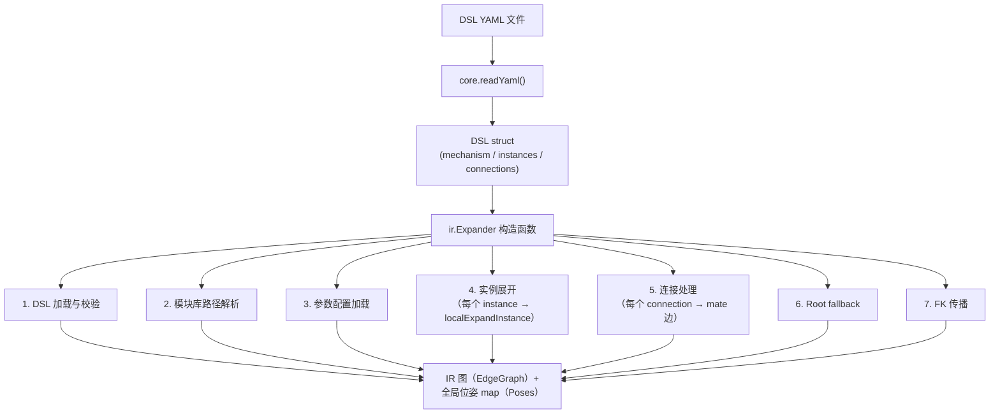
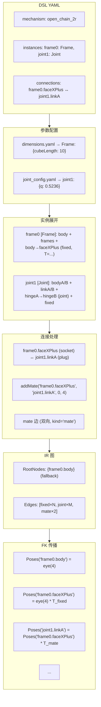

# DSL→IR 映射规则（阶段 A.3.1）

> 本文档定义 DSL 机构描述文件到 IR（中间表示）图的完整映射管线。
> 权威代码来源：`scripts/matlab/+ir/Expander.m` 构造函数 + `localExpandInstance` 全函数。
>
> **状态**：A.3.1 v0。以已验证的 MATLAB 代码为准反推，非从零设计。

---

## 1. 总体管线



管线入口：`ir.Expander(dslYaml, configYaml)`（Expander.m L47）

---

## 2. 步骤 1：DSL 加载与校验

### 2.1 路径解析

```matlab
% Expander.m L52-56
here = fileparts(fileparts(mfilename('fullpath')));
dslYaml = core.PathUtils.resolve(dslYaml, here);
```

DSL 文件路径相对于 `scripts/matlab/` 解析为绝对路径。

### 2.2 加载

```matlab
% Expander.m L58-59
dsl = core.readYaml(dslYaml);
assert(isfield(dsl, 'mechanism'), ...);
```

### 2.3 版本校验

```matlab
% Expander.m L61-62
ver = core.CommonUtils.field(dsl, 'dsl_version', 0);
assert(isequal(ver, 0), ...);
```

仅支持 `dsl_version: 0`。

### 2.4 机构名提取

```matlab
% Expander.m L64
obj.MechName = dsl.mechanism;
```

---

## 3. 步骤 2：模块库路径解析

```matlab
% Expander.m L66-72
dslDir = fileparts(dslYaml);
libRel = core.CommonUtils.field(dsl, 'module_library', '../../modules/');
obj.LibDir = core.PathUtils.resolve(libRel, dslDir);
assert(exist(obj.LibDir, 'dir') > 0, ...);
```

- `module_library` 字段为相对路径，默认 `'../../modules/'`
- 相对于 DSL 文件所在目录解析为绝对路径
- 路径必须存在，否则断言失败

---

## 4. 步骤 3：参数配置加载

### 4.1 几何参数（dimensions.yaml）

```matlab
% Expander.m L75-78
dimCfg = struct();
dimCfgPath = fullfile(obj.LibDir, 'config', 'dimensions.yaml');
if exist(dimCfgPath, 'file'); dimCfg = core.readYaml(dimCfgPath); end
```

- 路径：`<module_library>/config/dimensions.yaml`
- 结构：`module_type → {param: value, ...}`，如 `Frame: {cubeLength: 10}`
- 文件缺失时 `dimCfg` 为空 struct（不影响无参模块）

### 4.2 关节变量覆盖（joint_config.yaml）

```matlab
% Expander.m L81-85
jointCfg = struct();
if ~isempty(configYaml)
    configYaml = core.PathUtils.resolve(configYaml, here);
    if exist(configYaml, 'file'); jointCfg = core.readYaml(configYaml); end
end
```

- 由 `configYaml` 参数指定，相对于 `scripts/matlab/` 解析
- 结构：`instanceName → {variable: value, ...}`，如 `joint1: {q: 0.5236}`
- 文件缺失时 `jointCfg` 为空 struct

### 4.3 参数合并顺序

```
dimCfg[module_type]          ← 基底（模块类几何参数）
    ↓ 覆盖
jointCfg[instance_name]      ← 覆盖层（per-instance 关节变量）
    ↓
最终 params struct            ← 传入 localExpandInstance
```

合并代码：

```matlab
% Expander.m L178-189
params = struct();
if isfield(dimCfg, itype)
    params = dimCfg.(itype);       % 基底
end
if isfield(jointCfg, iname)
    ov = jointCfg.(iname);         % 覆盖层
    if isstruct(ov)
        ofn = fieldnames(ov);
        for q = 1:numel(ofn); params.(ofn{q}) = ov.(ofn{q}); end
    end
end
```

---

## 5. 步骤 4：实例展开

### 5.1 迭代入口

```matlab
% Expander.m L94-101
for i = 1:nInst
    iname = instNames{i};
    itype = dsl.instances.(iname).type;
    obj.Instances(i) = obj.localExpandInstance(iname, itype, dimCfg, jointCfg);
end
```

### 5.2 模块定义加载与缓存

```matlab
% Expander.m L166-175 (localExpandInstance)
if isKey(obj.DefCache_, itype)
    md = obj.DefCache_(itype);           % 缓存命中
else
    fp = fullfile(obj.LibDir, [itype '.yaml']);
    md = core.readYaml(fp);              % 首次加载
    obj.DefCache_(itype) = md;           % 写入缓存
end
```

- 缓存 key = `module_type`（如 `'Frame'`、`'Joint'`）
- 同一 `module_type` 在单次 Expander 生命周期内只读一次 YAML

### 5.3 参数注入

见 §4.3。

### 5.4 名前缀

```matlab
% Expander.m L192
pre = [iname '.'];
```

所有元素名均加此前缀，形成实例限定名。

### 5.5 Body 展开

```matlab
% Expander.m L196-201
bList{k} = struct('node', [pre b.name], 'name', b.name, ...
    'geometry', core.CommonUtils.field(b, 'geometry', ''));
```

| DSL 字段 | IR 字段 | 变换 |
|------|------|------|
| `bodies[].name` | `name` | 保持 |
| — | `node` | `instanceName.name` |
| `bodies[].geometry` | `geometry` | 保持（空则 `''`） |

### 5.6 Frame 展开

```matlab
% Expander.m L204-217
fList{k} = struct('node', node, 'name', f.name, ...
    'exposed', isfield(f, 'exposed') && isequal(f.exposed, true), ...
    'polarity', core.CommonUtils.field(f, 'polarity', ''), ...
    'semantic_tag', core.CommonUtils.field(f, 'semantic_tag', ''), ...
    'symmetry', core.CommonUtils.field(f, 'symmetry', 4));
```

| DSL 字段 | IR 字段 | 默认值 |
|------|------|------|
| `frames[].name` | `name` | — |
| — | `node` | `instanceName.name` |
| `frames[].exposed` | `exposed` | `false` |
| `frames[].polarity` | `polarity` | `''` |
| `frames[].semantic_tag` | `semantic_tag` | `''` |
| `frames[].symmetry` | `symmetry` | `4` |

**特殊处理 — Root 自动注册**：

```matlab
% Expander.m L299-305
if strcmp(core.CommonUtils.field(f, 'semantic_tag', ''), 'root')
    obj.EdgeGraph_.addRoot(node);
end
```

> `semantic_tag: root` 和 `semantic_tag: ground` 是两个不同标签：`root` 触发 root 注册，`ground` 仅标识 L3 世界绑定端点。

### 5.7 FixedTransform 展开

```matlab
% Expander.m L220-226
tr = core.CommonUtils.evalVec(t.translation, params);
R = core.RigidBodyMath.rot(t.rotation, params);
T = core.RigidBodyMath.T(R, tr);
obj.EdgeGraph_.addFixedTransform([pre t.from_frame], [pre t.to_frame], T);
```

- `translation` 分量通过 `evalVec` 求值（符号表达式 → 数值）
- `rotation` 通过 `RigidBodyMath.rot` 求值（支持 align / rpy / axis_angle）
- 边端点同样加实例前缀

### 5.8 Joint 展开

```matlab
% Expander.m L229-245
ax = core.CommonUtils.evalVec(j.axis, params);
val = core.CommonUtils.field(params, j.variable, 0);
kind = core.CommonUtils.field(j, 'kind', 'revolute');
obj.EdgeGraph_.addJoint([pre j.from_frame], [pre j.to_frame], ax, val, kind);
```

- `axis` 通过 `evalVec` 求值
- `variable` 的值从 params 中查找，未提供时默认 `0`（零位）
- `kind` 默认 `'revolute'`
- Joint 记录同步写入 `jList`（含归一化轴 + 变量名/值/类型）

---

## 6. 步骤 5：连接处理

### 6.1 端口引用解析

```matlab
% Expander.m L254-259 (localParsePort)
d = strfind(ref, '.');
instName = ref(1:d(1)-1);
portName = ref(d(1)+1:end);
```

DSL 引用 `instanceName.portName` → 切分为两部分。不含 `.` 时报错。

### 6.2 Frame 查找

```matlab
% Expander.m L262-273 (localLookupFrame)
for i = 1:numel(obj.Instances)
    if ~strcmp(obj.Instances(i).name, instName); continue; end
    for k = 1:numel(obj.Instances(i).frames)
        if strcmp(obj.Instances(i).frames{k}.name, portName)
            f = obj.Instances(i).frames{k}; return;
        end
    end
end
```

在已展开的实例数组中按 `instanceName` 和 `portName`（无前缀）查找 frame struct。

### 6.3 极性校验

```matlab
% Expander.m L121-133
polA = fa.polarity; polB = fb.polarity;
if strcmp(polA, 'socket') && strcmp(polB, 'plug')
    sk = fa; pl = fb;
elseif strcmp(polA, 'plug') && strcmp(polB, 'socket')
    sk = fb; pl = fa;
else
    error('ir:Expander:polarity', ...);
end
```

- 仅 `socket ↔ plug` 合法
- socket 为父、plug 为子（影响 mate 变换方向）
- 极性不互补时报错

### 6.4 Mate 边插入

```matlab
% Expander.m L136-144
roll = core.CommonUtils.field(cn, 'roll', 0);
sym = core.CommonUtils.field(sk, 'symmetry', 4);
isClosed = isequal(core.CommonUtils.field(cn, 'closed', false), true);

if ~isClosed
    obj.EdgeGraph_.addMate(sk.node, pl.node, roll, sym);
else
    obj.EdgeGraph_.addClosedMate(sk.node, pl.node, roll, sym);
end
```

| DSL 字段 | 默认值 | 行为 |
|------|------|------|
| `roll` | `0` | 离散滚转索引 |
| `symmetry` | `4`（来自 socket frame） | 旋转对称阶 |
| `closed` | `false` | `false` → `addMate`（生成树边）；`true` → `addClosedMate`（弦边） |

---

## 7. 步骤 6：Root Fallback

```matlab
% Expander.m L166-168
if ~obj.EdgeGraph_.hasRootNodes()
    obj.EdgeGraph_.addRoot(obj.Instances(1).bodies{1}.node);
end
```

若模块定义中无 `semantic_tag: root` 的 frame，则以第一个实例的第一个 body 为 root。

> **工具端生长范式**：在 tool-rooted growth 范式下，工具模块（如 `ToolPipette`）的参考 frame 应标记 `semantic_tag: root` 以自动注册为 root（`ToolPipette.connector_side` 即如此标记）。若忘记标记，此 fallback 会以第一个 DSL 实例的第一个 body 为 root。

---

## 8. 步骤 7：FK 传播

```matlab
% Expander.m L154
obj.Poses = obj.EdgeGraph_.propagate();
```

委托 `EdgeGraph.propagate()`：
1. 以 RootNodes 为种子（$T = I_4$）
2. 调用 `toStruct()` 过滤边（排除 `closed_mate`，剥离 `kind`）
3. 委托 `PosePropagator.propagatePoses` 执行迭代 FK

输出：`containers.Map`，key = frame 实例限定名，value = 4×4 全局位姿。

---

## 9. 完整数据流



---

## 代码对照表

| 规范条目 | 代码位置 |
|------|------|
| DSL 加载与校验 | `Expander.m` L52-64 |
| 模块库路径解析 | `Expander.m` L66-72 |
| `dimensions.yaml` 加载 | `Expander.m` L75-78 |
| `joint_config.yaml` 加载 | `Expander.m` L81-85 |
| 参数合并（dimCfg + jointCfg） | `Expander.m` L178-189 |
| 实例展开循环 | `Expander.m` L94-101 |
| 模块定义加载 + 缓存 | `Expander.m` L166-175 |
| Body 展开 | `Expander.m` L196-201 |
| Frame 展开 | `Expander.m` L204-217 |
| Root 自动注册 | `Expander.m` L299-305 (`semantic_tag == 'root'`) |
| FixedTransform 展开 | `Expander.m` L220-226 |
| Joint 展开 | `Expander.m` L229-245 |
| 端口引用解析 | `Expander.m` L254-259 |
| Frame 查找 | `Expander.m` L262-273 |
| 极性校验 | `Expander.m` L121-133 |
| Mate 边插入（含 closed 判断） | `Expander.m` L136-144 |
| Root fallback | `Expander.m` L166-168 |
| FK 传播 | `Expander.m` L154 → `EdgeGraph.propagate` |
