# 统一建模约定（阶段 A.0）

> 本文档冻结所有后续模块定义、DSL 与解释器都必须遵守的基础约定。
> 凡是与本文档冲突的写法一律视为非法。术语定义见 `terminology.md`，
> 机器可读常量见 `conventions.yaml`（本文档每节末尾的 `→ conventions.yaml` 标注对应 YAML key）。
>
> **状态**：A.0 冻结版本。修改本文件等同修改地基，必须同步更新 `terminology.md` 与 `conventions.yaml`。

---

## 1. 适用范围

- 本文档只规定建模约定与术语，不定义模块字段 schema（A.1）、DSL 语法（A.2）或解释器实现。
- 任意模块定义在不看图、不看 `slx` 的前提下，只凭本约定必须能被唯一解释。
- 所有数值与符号表达式都在本约定的单位、坐标系与旋转规则下解释。

---

## 2. 层级架构（建模层次）

整个符号化体系自底向上分为四层。每一层只由下一层组合而成，不跨层耦合；
解释器沿同一条层级链把机构编译成可求解的几何约束系统。

| 层 | 名称 | 内容 | 类比 |
|------|------|------|------|
| L0 | 元件 `Element` | 建模原语：`Body`/`Frame`/`Port`/`FixedTransform`/`Joint`/`Constraint`（见 §3） | Simscape 基本块 / URDF 基本类型 |
| L1 | 模块 `Module` | 把若干元件封装成的参数化模板，使用时实例化 | Simulink masked subsystem / library；OOP 类 + xacro 宏 |
| L2 | 机构 `Mechanism` | 多个模块实例按端口连接组成的机构本体 | Simulink 子系统 |
| L3 | 执行层 `Execution` | 世界系 + 外部驱动 / 驱动关节，闭合成可求解系统 | — |

### 2.1 L0 元件（Element）

符号化体系最底层的语素，是一组固定的建模原语，详见 §3。模块、机构、执行层、
解释器 IR 都只能由这些元件组合而成，不允许出现未登记的元件。

### 2.2 L1 模块（Module）

模块是把若干元件封装成的**参数化模板**，相当于一个类（class）：定义一次、多次实例化。
其参考来源是 `slx_module_reference` 中的库模块（`Frame`、`Pin`、`Joint`、`Adaptor`、`ToolPipette`）。

- **命名歧义警告**：模块 `Frame`（立方体结构模块）与元件 `Frame`（坐标系原语）同名但不同物。
  例如 `Joint` 模块内部封装了一个 `Joint` 元件加若干 `Port` 元件。行文中以「`Frame` 模块」「`Joint` 模块」明示模块层。
- **模块 = 类，实例 = 对象**：每次在机构中使用模块都等于由模板创建一个实例，实例携带自己的名字与实例参数（见 §11）。
- **模块对外只暴露 `Port`**：内部 `Body`/`Frame`/`FixedTransform`/`Joint` 为实现细节，跨模块只能通过 `Port` 连接。
- **结构模块 vs 运动模块**：`Frame`/`Pin`/`Adaptor` 偏结构与坐标适配（无自由度），`Joint` 偏运动原语（含自由度）。

### 2.3 L2 机构（Mechanism）

机构是多个模块实例按端口连接组成的机构本体。

- 机构是一张图：节点为模块实例，边为端口连接（见 §10）。
- 机构本体可以是开环（树）或含闭环（一般图）；闭环是否真正闭合由执行层决定。
- 机构只描述「本体长什么样、怎么拼」，不描述「谁来驱动、固定在哪」。

### 2.4 L3 执行层（Execution）

执行层把机构本体接入世界系与驱动源，形成自洽、可求解的系统。它定义「机构如何被固定、如何被驱动、闭环判据是什么」。两种典型构型：

**闭环驱动（M-REx 主构型）**

外部驱动器提供多自由度驱动关节（比如 Microsupport就可以等效为一个 XYZ 3-DOF 关节），与世界系一起把机构闭合成环：

```
世界原点 → 外部驱动 #1 → 机构挂载点 #1 → 机构本体（末端执行器） → 机构挂载点 #2 → 外部驱动 #2 → 世界原点
```

闭合这条回路即产生**闭环判据**：解释器在回路切口处计算两侧坐标系的相对位姿误差，将其中不允许偏离零的分量作为残差方程，交由求解器消除（见 §3.5 `Constraint` 与 A.4）。

为使该闭环系统自洽，外部驱动器的安装配置须满足**初始零位条件**：在机构零位构型下，外部驱动器自身亦处于其运动范围的零位。实现方式如下：

1. 将机构末端执行器工具坐标系定义为在零位构型下与世界原点重合（即零位正运动学输出为恒等变换）。
2. 在此前提下，外部驱动器等效关节的框架原点相对世界原点的偏移量，等于机构在零位构型下从末端执行器到对应挂载点的正运动学结果——该偏移在配置阶段由解释器根据机构初始几何**预先计算**，并作为静态参数写入执行层定义。

关键区分：外部驱动器的框架偏移是**配置时静态标定**的几何量，而非要求驱动器在运行时输出额外补偿位移来拼合闭环。运行期间，驱动器仅输出相对于该标定零位的增量运动。

该外部驱动器由 `Manipulator` 关节模块物化（见 §5.6）：其 XYZ 三轴平移由内部三个 `prismatic` 关节（变量 `dx`/`dy`/`dz`）串联组合而成，等价于一个 3-DOF 笛卡尔关节。机构侧以 `socket` 端口 `dock` 对接 `Adaptor.mount_point`（`plug`），世界侧以 `ground` frame（无 `polarity`）由执行层绑定到 `world`；上文的静态零位偏移即写入 `Manipulator` 的接地配置。`Manipulator` 是 L1 模块，但物化了 L3 外部驱动：其关节在闭环构型下作为待求未知量，在开环构型下作为 `actuated` 输入（见下）。

> **L2 内部闭环 vs L3 世界系闭环**：上述 M-REx 主构型属于 **L3 世界系闭环**——回路因多个 `ground` frame
> 各带静态标定偏移绑定到同一 `world` 参考系而形成，DSL 中机构本体为开环链（不写 `closed: true`），切口由 L3 `closure_cuts`
> 声明。L2 内部闭环（如四杆环）则在 DSL 中用 `closed: true` 标记端口间补边，用于验证回路识别逻辑。
> 两种闭环的残差公式一致，详细对比见 `specs/dsl/connection-semantics.md` §6.4。

**开环驱动（测试构型）**

若关节自身可驱动（`actuated`，在执行层指派），则无需外部驱动器：直接驱动关节即可让机构形成开环串联构型，例如 3R 运动链。此时执行层只需世界系一个根加各驱动关节输入，解释器直接输出从世界系到末端的正运动学表达式，无闭环残差。

> 同一套机构本体（L2）可接入不同执行层（L3）：闭环执行得到闭环 IK 残差，开环执行得到开环 FK 表达式。这正是测试时「先开环跑通、再上闭环」的依据。

### 2.5 解释器沿层级链编译

解释器读取 L1 模块定义、L2 机构装配与 L3 执行配置，沿层级链展开成 §3 的元件级图，
再生成与 `inverse-kinematics-solver-design.md` 同构的几何约束（闭环）或正运动学表达式（开环），交给求解器。

> → `conventions.yaml` `hierarchy`

---

## 3. 元件类型（建模原语）

L0 元件是一组固定的建模原语，模块、机构、执行层、解释器 IR 都只能由其组合而成。
每个原语的英文名即解释器 IR 节点/边名（见 `terminology.md`）；在 DSL 与 IR 中一律采用小写驼峰形式（`body`、`frame`、`fixedTransform`、`joint`、`constraint`），详见 §4 命名规范。
完整字段定义见 `module-definition.schema.yaml`。

| 元件 | 类别 | 含义 | 关键规则 |
|------|------|------|------|
| `Body` | 节点 | 刚体，承载几何并自带一个中心 `Frame`（`name` + 可选 `geometry`） | 所有 `Frame` 以中心 Frame 为基准定位 |
| `Frame` | 节点 | 局部右手坐标系；`Port` = `exposed=true` 的 `Frame`（`name` + `host` + 可选 `exposed`/`semantic_tag`/`polarity`/`symmetry`/`observable`） | 自身不携带偏移；位姿由一条 `FixedTransform`（中心 Frame → 本 Frame）给出。`exposed` 与 `observable` 正交（§3.6） |
| `FixedTransform` | 边 | 两 Frame 间无自由度刚性位姿（`from_frame` + `to_frame` + `translation` + `rotation`） | 先平移后旋转（§8） |
| `Joint` | 边 | 引入自由度的运动副（`from_frame`/`to_frame` + `kind`∈{revolute,prismatic} + `axis` + `variable` + 可选 `limit`/`observable`） | 至少 1 DOF；revolute 变量用 `q`，prismatic 用 `d` |
| `Constraint` | 边 | 闭环相容的代数条件（`frame_pair` + `components` ⊆ {tx,ty,tz,rx,ry,rz}） | **仅 A.4 解释器生成**，不出现在模块（L1）或机构（L2）定义中。残差 = $T_{\text{far}}^{-1} \cdot T_{\text{near}}$，分量由 DOF 分析决定 |

### 3.6 可观测变量管线（observable → registry → partition → solve）

`observable` 标记声明「这个量是有意义的观测目标」，不赋予求解语义。求解方向（FK/IK）由用户在 A.3 执行层通过变量分区（`known`/`unknown`）决定。

```mermaid
flowchart LR
    subgraph A1["A.1 模块定义"]
        A1a["frame.observable: true"]
        A1b["joint.observable: true"]
    end
    subgraph A3_expand["A.3 IR 展开"]
        A3a["variable registry:"]
        A3b["pipette.tip_origin"]
        A3c["mc1.dx"]
        A3d["mc1.dy"]
        A3e["joint_ab.q"]
    end
    subgraph A3_exec["A.3 执行配置"]
        A3f["user partition:"]
        A3g["known: [mc1.dx, ...]"]
        A3h["unknown: [tip_origin, joint_ab.q]"]
    end
    subgraph A4A5["A.4/A.5 求解"]
        A4a["f(unknown)=0"]
        A4b["given known → solve"]
    end
    A1 --> A3_expand --> A3_exec --> A4A5
```



**`exposed` 与 `observable` 正交性**：

| `exposed` | `observable` | 含义 | 典型例子 |
|-----------|-------------|------|---------|
| `true` | `false` | 机械端口，可被 mate | `Frame.faceZPlus`、`Adaptor.mount_point` |
| `true` | `true` | 端口 + 观测 world 位姿 | `Manipulator.dock`、`Manipulator.ground` |
| `false` | `true` | 内部观测点，不可连接 | `ToolPipette.tip_origin` |
| `false` | `false` | 纯内部 frame | `Joint` 模块的 `hingeA`/`hingeB` |

**变量分区决定求解方向**：`known` = 驱动位移 → FK；`known` = 末端位姿 → IK。改 partition 即可改变求解方向，无需修改模块定义或 DSL。

| Simulink | 本项目 |
|----------|--------|
| 信号线 → Scope / outport | `observable: true` → registry → partition |
| FK：给定驱动，仿真输出末端 | `known` = 驱动位移，`unknown` = 末端位姿 |
| IK：给定末端轨迹，反推驱动 | `known` = 末端位姿，`unknown` = 驱动位移 |
| 改 FK/IK 需重新连线/换模型 | 改 partition 即可 |

> → `conventions.yaml` `element_types`

---

## 4. 命名规范

DSL 源码与解释器 IR 中，元件类型名与模块类型名遵循不同的大小写规则，从根本上消除同名歧义：

| 层次 | 对象 | 规则 | 示例 |
|------|------|------|------|
| L0 元件 | 建模原语类型名 | 小写驼峰（lowerCamelCase） | `body`、`frame`、`fixedTransform`、`joint`、`constraint` |
| L1 模块 | 模块类型名 | 首字母大写（UpperCamelCase） | `Frame`、`Pin`、`Joint`、`Adaptor`、`ToolPipette` |
| L2 实例 | 模块实例名 | 小写驼峰或下划线分隔 | `frame_1`、`myJoint`（不得与元件关键字重名） |
| 参数 | 几何／配置参数名 | 小写驼峰 | `cubeLength`、`tipDistance` |

规则说明：

- **元件名**（`body`、`frame`、`fixedTransform`、`joint`、`constraint`）是 DSL 的固定关键字，不可自定义扩展，不可写成 UpperCamelCase。
- **模块名**首字母大写，使用纯 UpperCamelCase（无下划线，如 `ToolPipette`）。
- 此规则使 `frame`（元件：局部坐标系原语）与 `Frame`（模块：立方体结构件）、`joint`（元件：运动副原语）与 `Joint`（模块：铰接关节件）在 DSL 中仅凭大小写即可区分，无需上下文推断。
- 本文档行文为可读性沿用首字母大写指代元件类型名；**凡出现于 DSL 代码或解释器 IR 时，必须使用小写驼峰形式**。

> → `conventions.yaml` `naming`

---

## 5. 核心模块库一览

以下 6 个 L1 模块是当前模块库的最小核心集。完整字段定义、端口变换精确数值与内部运动学图见各模块 YAML（`specs/modules/`），由 `module-definition.schema.yaml` 校验。

| 模块 | 类别 | DOF | 端口 | 极性 | YAML |
|------|------|------|------|------|------|
| `Frame` | 结构 | 0 | 6 面 `faceX±`/`faceY±`/`faceZ±` | socket | `Frame.yaml` |
| `Pin` | 结构 | 0 | `sideA`、`sideB` | plug | `Pin.yaml` |
| `Joint` | 运动 | 1 (revolute) | `linkA`、`linkB` | plug | `Joint.yaml` |
| `Adaptor` | 结构 | 0 | `attachment_point`、`pin_connector` | plug | `Adaptor.yaml` |
| `ToolPipette` | 结构 | 0 | `connector_side`(plug)、`tip_origin`(无极性) | — | `ToolPipette.yaml` |
| `Manipulator` | 运动 | 3 (cartesian = 3×prismatic) | `dock`(socket)、`ground`(无极性) | — | `Manipulator.yaml` |

**关键规则**（详见各 YAML）：
- `Frame` 六面端口的 `+Z` 统一朝外（外法向），`+X` 为面内零 roll 参考（§9.4）。
- `Joint` 内部拓扑：`linkA ←fixed— bodyA —[revolute(q)]— bodyB —fixed→ linkB`。
- `Manipulator` 内部拓扑：`ground ←fixed— base —[prismatic dx]— stageX —[prismatic dy]— stageY —[prismatic dz]— carriage —fixed→ dock`。零位（dx=dy=dz=0）为恒等变换。
- 模块类几何参数（如 `Frame.cubeLength`、`ToolPipette.tipDistance`）取值见 `specs/modules/config/dimensions.yaml`。

> → `conventions.yaml` `element_types.nodes.body` / `element_types.nodes.frame` / `element_types.edges.joint`

---

## 6. 坐标系约定

### 6.1 全局坐标系

- 所有坐标系均为**右手系**。
- 全局世界坐标系记作 `world`，是机构图的唯一根。任何机构描述必须有且只有一个 `world` 根。
- 轴语义：`+X` 主操作/前向，`+Y` 侧向，`+Z` 向上（与基座平面法向同向）。
- 重力方向为 `-Z`。本阶段不参与求解，仅作语义基准。

### 6.2 局部坐标系

- 每个刚体、端口、关节轴都拥有自身局部坐标系，均为右手系。
- 局部系到父系的关系一律用「平移 + 旋转」表示，先平移后旋转的复合顺序在 §8 固定。

---

## 7. 单位约定

| 量 | 单位 | 说明 |
|------|------|------|
| 长度 | mm | 平移、几何尺寸一律毫米 |
| 角度（内部） | rad | 表达式、变换、求解一律弧度 |
| 角度（输入） | deg 或 rad | 允许以 deg 输入，但必须显式标注，由解释器转 rad |

- 系统边界（DSL 输入、求解输入）处的每个角度量必须标注单位；内部一律 rad。
- SLX 抽取的 `[0, -5, 0]`、`cubeLength/2` 等数值默认 mm，与 `module_library_reference.md` 一致。

---

## 8. 旋转与姿态约定

- 旋转正方向遵循右手定则：拇指指轴正向，四指为正向转角。
- **权威姿态表示**：单位轴角（轴 `omega` + 转角 `q`，Rodrigues 公式），用于关节与解释器内部 IR。
- **对外展示表示**：Z-Y-X 内旋欧拉角，`R = Rz(psi) · Ry(theta) · Rx(phi)`，与 `inverse-kinematics-solver-design.md` 范本一致。
- 四元数若出现，顺序为 `[w, x, y, z]`。
- 复合变换顺序固定为「先平移后旋转」：局部点 `p_parent = t + R · p_local`。

> → `conventions.yaml` `coordinate_system` / `units` / `rotation`

---

## 9. 端口（Port）约定

### 9.1 端口的数学含义

端口即 `exposed=true` 的 `Frame`，是一个完整局部右手坐标系：

- 主轴：端口 **`+Z` 统一为朝模块外的对插法向**。两端口对接时的面对面翻转由解释器统一施加（见 §10）。
- 切向参考：端口 **`+X` 用来定义零 `roll` 时的面内参考方向**；它是连接语义的一部分（见 §10.2~§10.3）。
- 位姿：相对宿主中心 `Frame` 的平移与朝向，由一条 `FixedTransform` 给出，不在端口本体声明。

可选信息（不参与运动学与连接求解）：

- 语义标签：用于文档可读性、UI 分组或后续非机械接口扩展（见 §9.3）

### 9.2 命名规则

- 格式：`语义名 + 朝向/角色`，全程稳定可解析。
- 朝向类：`faceXPlus`、`faceXMinus`、`faceYPlus`、`faceZMinus` 等（轴 + 正负号）。
- 角色/序号类：`sideA`、`sideB`、`linkA`、`linkB`、`dock`、`tip_origin`。
- 同一模块内端口名唯一；正则约束见 schema。

### 9.3 端口语义

当前阶段采用**等价物理端口假设**：

- 所有机械端口在物理连接语义上等价，均按刚性 frame 连接处理。
- 标签不改变连通性、自由度、约束构造或求解器行为。
- 连接是否合法仅由端口坐标系与 mate 规则决定（见 §10）。

后续若引入流道/线路等非机械接口，可新增独立接口类型，不复用机械端口标签语义。

### 9.4 轴对齐（alignA / alignB）

- 端口相对刚体的定向用两条对齐规则 `alignA`、`alignB` 确定，每条为 `源轴 -> 目标轴`。
- 两条规则确定旋转后，第三轴由右手系唯一推出，不再单独声明，避免歧义。
- 写 `align` 时应优先显式约束两条轴：先固定端口 `+Z` 指向外法向，再固定端口 `+X` 指向该端口的面内参考方向；第三轴 `+Y` 由右手系自动推出。
- 对机械对接口，`+X` 的作用是冻结 **`roll = 0`** 的参考朝向。连接中的 `Rx(π)` 会保持两端口的 `+X` 对齐，只把 `+Y`、`+Z` 翻到面对面状态（见 §10.2）。
- 因此，不能用“看起来向左/向右”这类观察者相关说法定义端口朝向；`+X`/`+Y` 必须由宿主坐标系中的几何规则唯一决定。
- 对正交结构面，推荐采用以下**规范化取向规则**：
  1. 先令端口局部 `+Z =` 该面的外法向。
  2. 若宿主 `+Z` 不与该法向平行，则令端口局部 `+X` 取宿主 `+Z` 在该面切平面上的投影方向。
  3. 若宿主 `+Z` 与该法向平行或反平行（顶/底面退化情形），则令端口局部 `+X =` 宿主 `+X`。
  4. 端口局部 `+Y` 由右手系唯一推出。
- 对 `Frame` 模块，上述规则落地为：`faceX±`、`faceY±` 的局部 `+X = +Z`；`faceZ±` 的局部 `+X = +X`。这保证六个面的 `+Z` 全部朝外，同时给出稳定的零 `roll` 参考。

> → `conventions.yaml` `port`

### 9.5 端口极性（polarity）

端口的机械对接极性决定「谁能连谁」。取值二选一：

| 极性 | 现实对应 | 归属 |
|------|------|------|
| `socket` | 凹面 + 不锈钢贴片（凹陷接收面） | `Frame` 的六个面端口 + `Manipulator.dock`（外部驱动对接口） |
| `plug` | 凸面 + 磁铁（凸出对插面） | 所有贴到 `socket` 面上的机械面（`Pin`、`Joint`、`Adaptor`、工具连接面等） |

规则：

- **`socket` 提供者为 `Frame` 与 `Manipulator`**：`Frame` 六面是体素枢纽（hub）的 `socket`；`Manipulator.dock` 额外提供一个 `socket`，用于对接外部驱动侧的 `Adaptor.mount_point`（`plug`）。其余一切机械对接面均为 `plug`。
- 由此自然得到合法性：`socket↔plug` 合法；`socket↔socket`、`plug↔plug`（pin–joint、pin–pin、joint–joint）一律非法。
- `polarity` **可选**：只有机械对接面才声明。任务/工具参考系（如 `tip_origin`）不带 `polarity`，不能作为连接端（§9.1）。**例外**：`Manipulator.ground` 也不带 `polarity`，但它是世界侧**接地系**，由 L3 执行层绑定到 `world`（非机械 mate，不受 `socket↔plug` 门控）。
- 极性只是**逻辑门控**，不改变运动学；它只决定连接是否被允许，连接生成的几何仍由 §10 的 mate 变换给出。

### 9.6 旋转对称阶（symmetry）

描述端口机械接口绕 `+Z` 对插法向的旋转对称性，用于约束连接 `roll`（§10）的合法离散取值。

- `symmetry: n` 表示绕 `+Z` 每转 `360/n` 度，机械接口自我等价（仍能照常对接）。
- 当前方钢片接口为 **C4**，故缺省 `symmetry = 4`（合法 `roll` 步进为 `0/90/180/270`）。模块定义中一般无需显式书写，仅在偏离默认时覆盖。
- **对称阶只约束「哪些 roll 合法」**，不决定「roll 是否可观测」：结构面（`Frame`/`Pin`）绕法向旋转在对称群内无差别；但若端口背后藏有打破对称的内部特征（如 `Joint` 的关节轴），同一个合法 roll 会转动该内部特征——这正是无需垫片即可改变关节轴朝向的机理（见 §10）。

---

## 10. 连接（Connection）约定

**连接的含义唯一**：把两个端口**面对面对插贴合**。所有端口 `+Z` 统一朝外（§9.1），解释器在装配时按极性自动施加一个**标准 mate 变换**，使两端口面对面重合。连接本身不携带任意空间变换或运行时自由度；凡需坐标适配或引入运动自由度的场合，必须在两端口间插入相应**模块**，而非赋予连接新语义。

### 10.1 极性门控

- 连接仅允许 `socket↔plug`（§9.5）。`socket↔socket`、`plug↔plug`、以及任一端无极性（任务系）均由解释器直接判非法。
- 极性只决定合法性，不产生几何。

### 10.2 标准 mate 变换（冻结）

设连接的 `socket` 端为父、`plug` 端为子，二者 `+Z` 均朝外。子端口坐标系相对父端口坐标系的位姿为：

$$T_{\text{plug} \leftarrow \text{socket}} = R_z\!\left(\text{roll} \cdot \tfrac{360^\circ}{\text{symmetry}}\right) \cdot R_x(\pi), \qquad t = 0$$

- `Rx(π)`：**冻结**为绕端口 `+X` 翻转 180°——把 `+Z` 翻成反平行（两法向面对面）、`+Y` 翻转、`+X` 不变。这实现了「面对面对插」而非「坐标系数值相等」。
- `Rz(...)`：绕公共对插法向的**离散滚转**（§10.3）。
- 平移为零：两对接面在原点相触；任何法向间隙属于模块几何，不属于连接。

### 10.3 离散滚转（roll）

物理接口绕法向有 `symmetry` 阶对称（§9.6），故装配时可在若干等价朝向中择一。该选择是**装配自由度**，归属于连接而非端口：

- 连接携带整数字段 `roll`（缺省 0），实际滚转角 = `roll · 360/symmetry` 度；合法取值 `0 .. symmetry-1`。
- **仅离散**：`roll` 永远落在对称群内，故机械上必然装得上。真正需要**运行时连续绕法向转动**的场合，不用 `roll`，而是在两端口间插入一个 revolute `Joint` 模块（关节轴取公共法向 `+Z`）——那是真自由度，与装配朝向语义分离。
- **可观测性**：对结构面（`Frame`/`Pin`）`roll` 在对称群内无差别，纯装配记号；对 `Joint` 这类内部藏有关节轴的端口，`roll` 会同步转动关节轴，从而无需「扭 90° 的垫片模块」即可改变关节轴朝向。

### 10.4 其他情形的正确处理

- **坐标适配**（原 `adaptor`）：在两端口间插入 `Adaptor` 模块，由其内部 `FixedTransform` 承载所需平移/旋转，两侧各连接一次。
- **绕法向连续旋转**（原 `normal_aligned`）：插入 revolute `Joint` 模块，关节轴取公共法向 `+Z`；自由度由该 `Joint` 元件显式描述（区别于 §10.3 的离散 `roll`）。

### 10.5 连接合法性判据

- 极性互补：仅 `socket↔plug`（§10.1）。
- 每个端口至多被占用一次；重复占用为非法。
- `roll` 必须为 `0 .. symmetry-1` 的整数；越界或非整数为非法。

> → `conventions.yaml` `connection`

---

## 11. 参数作用域

| 作用域 | 归属 | 示例 |
|------|------|------|
| 模块类 | 模块类型定义 | `cubeLength`、`tipDistance` |
| 实例 | 单个模块实例 | 实例化时传入的几何/安装参数 |
| 机构配置 | 整个机构 | 任务位姿、求解边界、初值 |

- 参数表达式允许保留符号形式（`cubeLength/2`、`-tipDistance`），A.0/A.1 阶段不强制数值化。

> → `conventions.yaml` `parameter_scopes`

---

## 12. 过关标准

- `Frame` 与 `Joint` 仅凭本文档手工推出的端口位姿，与 `module_library_reference.md` 一致。
- 同一连接关系无两种等价但解释不同的写法。
- 本文档、`terminology.md`、`conventions.yaml` 三者无矛盾。
